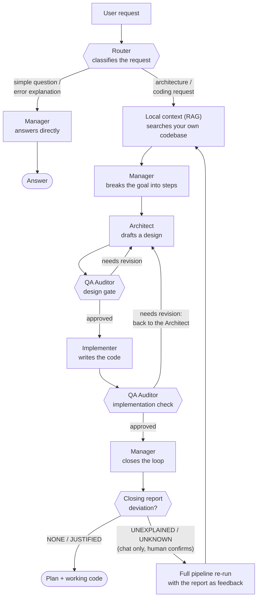

# LocalDevEngine

A local, Ollama-powered coding assistant that routes each request through a **pipeline of specialized models** instead of asking one model to do everything.

Small classification/formatting jobs go to a small model. Deep design reasoning goes to a large one. Code review goes to a model tuned for following a strict verdict format. Nothing runs unless the task actually needs it. The result: better answers per stage, and VRAM spent only where it matters — all on hardware you own, with nothing sent to a third-party API.

## Why a pipeline instead of one model

A single general-purpose model is a compromise: fast enough for quick questions, but not deep enough for a real architecture decision — or deep enough for architecture, but too slow and too heavy to keep loaded for a one-line question. LocalDevEngine splits the work into **stages**, each backed by whichever model is actually good (and fast) at that stage, and only pays for the stages a given request needs.

## How a request flows through the system



Four things worth noticing in that diagram:

- **The fast path.** Not every request needs the full pipeline. A router model reads the request first and, for simple questions or "why did this error happen" reactions, the Manager answers immediately — skipping context retrieval, design, and code generation entirely.
- **The design gate happens before any code is written.** The Architect's plan is reviewed by an independent QA model *before* the Implementer touches it. Catching a bad design assumption on paper is a lot cheaper than catching it in code — and generated code gets a second, separate review of its own.
- **Implementation feedback goes back through the Architect, not straight to the Implementer.** If the post-implementation review finds a problem, it's treated as a design issue first: the Architect updates the plan, then the Implementer re-writes the code against the revised plan.
- **The Manager closes its own loop.** After QA approves the implementation, the Manager compares the final result against its own original outline and classifies each step as covered, adapted, dropped, or added. If something was dropped or added without a clear reason, the interactive `chat` session — never the scriptable `ask` command — offers a human-confirmed re-run of the whole pipeline with that report fed back in as feedback, capped at one extra pass by default.

## The stages

| Stage | Job | Model role |
|---|---|---|
| **Router** | Classify the request; decide if it needs the full pipeline | small, fast |
| **Local context (RAG)** | Pull relevant snippets from your own codebase | embedding model |
| **Manager** | Turn a goal into an ordered outline of steps | mid-size |
| **Architect** | Turn the outline into a concrete design (data model, interfaces, error handling, dependencies) | large, reasoning-focused |
| **Implementer** | Write the actual code from the approved design | large, coding-focused |
| **QA Auditor** | Review the design *and* the implementation against the original goal, hand back specific feedback | strict, format-disciplined |
| **Manager (closing report)** | Compare the final result against its own original outline; flag unexplained drops or additions | mid-size, same model as the outline step |

Which real Ollama model tag backs each role is a config choice, not a fixed requirement — see `config/settings.yaml`. Pick whatever fits your GPU; the pipeline shape stays the same.

## Getting started

### 1. Prerequisites

- Python 3.10+
- A local [Ollama](https://ollama.com) server (`ollama serve`), reachable at `http://localhost:11434` by default — override with the `LDE_OLLAMA_HOST` env var (e.g. `LDE_OLLAMA_HOST=http://localhost:11435/api`) if you're pointing at a different host or port
- Enough VRAM for whichever model is currently loaded — Ollama swaps models on demand, it doesn't need all of them resident at once

### 2. Install

```bash
git clone https://github.com/krukmat/LocalDevEngine.git
cd LocalDevEngine

python -m venv .venv
source .venv/bin/activate   # Windows: .venv\Scripts\activate

pip install -r requirements.txt
```

### 3. Pull the models

The default role → model mapping lives in [config/settings.yaml](config/settings.yaml). Pull whatever it currently points to, for example:

```bash
ollama pull phi3:mini                  # router
ollama pull gemma4:26b-a4b-it-qat      # manager + qa_auditor
ollama pull qwen3.6:35b-a3b            # architect + implementer
ollama pull nomic-embed-text:latest    # embeddings (RAG)
```

Don't have the VRAM for the defaults? Edit the `model_name` under each role in `config/settings.yaml` to any tag you've pulled locally — the pipeline shape doesn't change, only which model backs each stage. `settings.yaml` is also where you tune retrieval (`retrieval.top_k`, `max_context_chars`), QA retry limits (`pipeline.max_qa_iterations`), and the closing-report macro-loop (`pipeline.closing_report`, `pipeline.max_macro_iterations`).

### 4. Run it

```bash
# Index a codebase so the pipeline has local context to draw on
python main.py ingest ./path/to/project

# One-shot question through the pipeline
python main.py ask "add rate limiting to the API layer"

# Interactive session
python main.py chat
```

Output streams live as each stage produces it, so you see the Architect's plan and the Implementer's code being written in real time rather than waiting silently for the whole pipeline to finish.

`ask` always runs a single pass and exits — it's the scriptable path and never blocks on input. `chat` is where the human-in-the-loop re-run lives: if the Manager's closing report finds an unexplained deviation, `chat` (and only `chat`) prompts you to confirm one extra full pipeline pass, with the report handed back as feedback. The default answer is no.

### 5. Driving it from another program

`ask` also works as a non-interactive backend for another process (e.g. a CI job or another tool that delegates coding tasks to it):

```bash
# JSON receipt on stdout, live model stream redirected to stderr
python main.py ask --json "add rate limiting to the API layer"

# Write the receipt straight to a file instead
python main.py ask --json --out receipt.json "add rate limiting to the API layer"

# Suppress the live stream entirely
python main.py ask --json --quiet "add rate limiting to the API layer"

# Read the query from a file or stdin instead of argv
python main.py ask --json --input-file task.txt
cat task.txt | python main.py ask --json

# Force the Implementer/QA to follow a strict, machine-parseable file-block
# grammar instead of free prose (currently one profile: fenix-tagged-file)
python main.py ask --json --output-contract fenix-tagged-file "add rate limiting to the API layer"
```

Every call — including a failed or timed-out one — returns a JSON **receipt**: `status` (`completed`/`failed`/`timeout`), the query and its hash, timing, a `config_fingerprint` snapshot of the models/limits actually used, a per-stage `outcome` (did RAG run and find anything, did the design gate need revisions, was the implementation approved, what did the closing report conclude), and the full `trace`. Exit codes carry transport-level meaning only: **0** = the pipeline ran and produced a receipt (regardless of whether QA approved or a deviation was flagged — that's in the receipt, not the exit code), **2** = the engine itself failed or hit `pipeline.max_run_seconds` (still returns a partial receipt), **3** = usage error (bad flags, unknown command). The receipt is self-reported by the same code it describes, so treat it as a lead to verify, not proof — see [CLAUDE.md](CLAUDE.md)'s "The receipt" section for the full shape and caveats.

## Status

This is an actively evolving local tool, not a polished product — expect rough edges. For the detailed internal architecture, known gaps, and design rationale, see [README_DOCUMENTATION.md](README_DOCUMENTATION.md).
