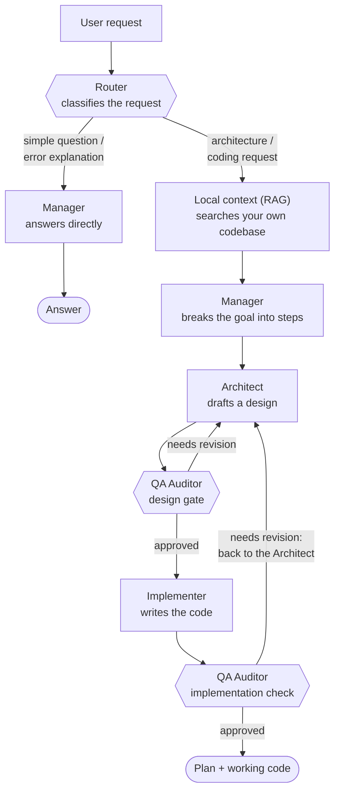

# LocalDevEngine

A local, Ollama-powered coding assistant that routes each request through a **pipeline of specialized models** instead of asking one model to do everything.

Small classification/formatting jobs go to a small model. Deep design reasoning goes to a large one. Code review goes to a model tuned for following a strict verdict format. Nothing runs unless the task actually needs it. The result: better answers per stage, and VRAM spent only where it matters — all on hardware you own, with nothing sent to a third-party API.

## Why a pipeline instead of one model

A single general-purpose model is a compromise: fast enough for quick questions, but not deep enough for a real architecture decision — or deep enough for architecture, but too slow and too heavy to keep loaded for a one-line question. LocalDevEngine splits the work into **stages**, each backed by whichever model is actually good (and fast) at that stage, and only pays for the stages a given request needs.

## How a request flows through the system



Three things worth noticing in that diagram:

- **The fast path.** Not every request needs the full pipeline. A router model reads the request first and, for simple questions or "why did this error happen" reactions, the Manager answers immediately — skipping context retrieval, design, and code generation entirely.
- **The design gate happens before any code is written.** The Architect's plan is reviewed by an independent QA model *before* the Implementer touches it. Catching a bad design assumption on paper is a lot cheaper than catching it in code — and generated code gets a second, separate review of its own.
- **Implementation feedback goes back through the Architect, not straight to the Implementer.** If the post-implementation review finds a problem, it's treated as a design issue first: the Architect updates the plan, then the Implementer re-writes the code against the revised plan.

## The stages

| Stage | Job | Model role |
|---|---|---|
| **Router** | Classify the request; decide if it needs the full pipeline | small, fast |
| **Local context (RAG)** | Pull relevant snippets from your own codebase | embedding model |
| **Manager** | Turn a goal into an ordered outline of steps | mid-size |
| **Architect** | Turn the outline into a concrete design (data model, interfaces, error handling, dependencies) | large, reasoning-focused |
| **Implementer** | Write the actual code from the approved design | large, coding-focused |
| **QA Auditor** | Review the design *and* the implementation against the original goal, hand back specific feedback | strict, format-disciplined |

Which real Ollama model tag backs each role is a config choice, not a fixed requirement — see `config/settings.yaml`. Pick whatever fits your GPU; the pipeline shape stays the same.

## Getting started

Requires a local [Ollama](https://ollama.com) server running, with the models referenced in `config/settings.yaml` pulled.

```bash
pip install -r requirements.txt

# Index a codebase so the pipeline has local context to draw on
python main.py ingest ./path/to/project

# One-shot question through the pipeline
python main.py ask "add rate limiting to the API layer"

# Interactive session
python main.py chat
```

Output streams live as each stage produces it, so you see the Architect's plan and the Implementer's code being written in real time rather than waiting silently for the whole pipeline to finish.

## Status

This is an actively evolving local tool, not a polished product — expect rough edges. For the detailed internal architecture, known gaps, and design rationale, see [README_DOCUMENTATION.md](README_DOCUMENTATION.md).
