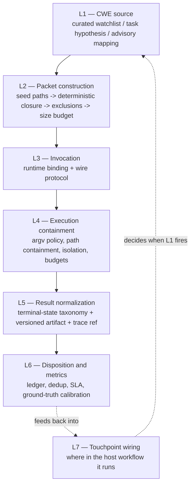

# Antares Advisory Localizer — Portability Guide

**Status:** incoming knowledge artifact. Not a plan, not an integration design, not an
approved task.

**What this is.** A distillation of a completed implementation of the Antares
vulnerability-localization advisor built in another repository (`dubbridge`, a Rust
workspace with a heavy governance layer), abstracted away from that repository's
specifics so it can be re-implemented here — a multi-model, Ollama-backed pipeline.

**What this is not.** It does **not** decide where Antares hooks into this pipeline,
which stage owns it, or what the code should look like here. Those are the adapting
agent's decisions. This document supplies the *inputs* to those decisions: what the
tool actually is, which properties are non-negotiable, which parts of the source
implementation are worth copying, which must be rebuilt, which should be deliberately
thrown away, and which traps already cost the source project real rework.

**How to read it.** §1–§2 are mandatory before any design work — §1 corrects the
single most expensive misunderstanding in the source project's history, and §2 is the
invariant kernel. §3–§8 are the layer-by-layer knowledge. §9 is the failure catalog.
§10 lists the questions this document deliberately leaves open for you.

---

## 1. What Antares actually is

Antares (Cisco Foundation AI, released 2026-07-21, open weights under Apache 2.0,
built on IBM Granite 4.0 checkpoints, 128K context, knowledge cutoff 2025-04-10;
variants `antares-350m`, `antares-1b`, `antares-3b`) performs **repository-level
vulnerability localization** and nothing else.

**The contract, stated precisely:**

> Given a **CWE identifier plus its generic category description**, plus a repository
> snapshot, it navigates that snapshot with a bounded budget of read-only terminal
> commands and returns a **ranked list of candidate files** likely to contain that
> weakness class, together with the exploration trace that produced the answer.

**It is an agentic terminal loop, not a single-shot prompt.** It emits `<think>`
reasoning blocks and `<tool_call>` JSON structures, consumes `<tool_response>`
messages appended to its context, is bounded to a small command budget (15 terminal
commands per the model card), and terminates by calling either
`submit_vulnerable_files` or `submit_no_vulnerability_found`.

### What it cannot do

Every item below is a documented limitation, not a conservative reading:

| It cannot | Consequence for your design |
|---|---|
| Choose or infer a CWE | The CWE is an **input**. Something outside the model must justify it. |
| Threat-model a change | The security reasoning stays with a human or the containing workflow. |
| Explain *why* a file is a candidate | There is no rationale field to surface. Don't design a UI for one. |
| Produce exploitation proofs | It is triage, not verification. |
| Recommend tests or remediation | Those belong to whatever stage already owns them. |
| Report line or span locations | Output is **file-level**. So is its benchmark metric. |
| Emit a confidence score | Any "confidence" in your artifact is something *you* computed. |
| Follow general instructions / chat | It is not a general-purpose model. Do not reuse it for another role. |

It also carries **no standalone safety evaluation** — the model card explicitly
requires sandboxed deployment — and it **degrades on repositories larger than ~10MB**
under its command budget.

### Documented weak classes

Weak on semantically-defined weakness classes, explicitly **CWE-732** (incorrect
permission assignment), **CWE-667** (improper locking), **CWE-401** (memory leak).
Take this seriously when building the watchlist (§4, §9.9).

### Measured accuracy, and how to read it

Cisco's Vulnerability Localization Benchmark — 500 tasks, 290 repositories, 147 CWE
categories, 6 ecosystems, 78% CVE-backed:

| Model | File F1 | Weights |
|---|---|---|
| GPT-5.5 (xhigh) | 0.229 | proprietary |
| Antares-3B | 0.223 | **not published** — see §5.3 |
| **Antares-1B** | **0.209** | open, gated |
| GLM-5.2 (753B) | 0.186 | open |
| Antares-350M | 0.135 | open, gated |
| Gemini 2.5 Flash | 0.102 | proprietary |

Two readings, both load-bearing:

1. A 1B model is competitive with far larger models **on this benchmark**. That
   justifies evaluating it locally; it does not establish local value.
2. `0.209` is a **macro-average of task-level scores**. It is *not* a per-output
   correctness probability, and no artifact, report, or UI may present it as one.
   Antares is triage assistance, never a source of verdicts.

### The expensive mistake, recorded so it isn't repeated

The source project's first plan revision was written **before the model card was
consulted**. It assumed Antares could threat-model, produce security rationale,
recommend tests, and propose risk scores. Every downstream artifact inherited that —
the output schema carried `summary`, `threat_surface`, `recommended_tests`,
`confidence`, `line`/`span`, and a risk-index proposal, none of which the model can
produce. The plan had to be materially rewritten.

**The abstract lesson:** bind capability claims to the model card *before* designing
the role, and write down the may/may-not boundary as a first-class artifact. A role
definition that over-claims is not a documentation bug; it silently propagates into
schemas, prompts, gates, and metrics.

---

## 2. The invariant kernel

These are the actual portable asset. Everything in §3 onward is one implementation of
them. If an adaptation preserves these and rewrites everything else, it is faithful.
If it copies code but drops one of these, it is not.

Each is stated with the failure it prevents.

| # | Invariant | Prevents |
|---|---|---|
| **I1** | **Advisory-only and non-blocking.** Antares never gates, delays, blocks, approves, closes, or fails anything. Its absence, failure, or degraded run is never a blocker. | A 0.209-F1 tool acquiring veto power over the pipeline. |
| **I2** | **The CWE comes from outside the model.** A curated watchlist entry, a human/agent security hypothesis, or a mapped advisory. Never a generic sweep "to satisfy ceremony". | Unjustified scans that generate noise and discredit the lane. |
| **I3** | **Every candidate requires a durable disposition.** An undisposed artifact is an *open* item, not a closed one. | Findings accumulating unread; a scan that nobody consumes. |
| **I4** | **Sandbox is mandatory, not optional.** The model issues shell commands and has no standalone safety evaluation. | Model-issued command execution against your real filesystem. |
| **I5** | **No shell. Ever.** Parse the tool call into `argv` and invoke the executable directly; reject redirects, pipes, control operators, substitutions, env assignments, and metacharacters. | Injection through a model-generated command string. |
| **I6** | **Path containment after symlink resolution.** Canonicalize every path operand; refuse absolute paths, `..`, and links resolving outside the snapshot. | Snapshot escape via a symlink or traversal the model emits. |
| **I7** | **Hard bounded budget with an explicit degraded terminal state.** Command count, per-command timeout, wall clock, output size. Exhaustion is a *named outcome*, not an error. | Unbounded loops, and "it failed" hiding "it ran out of budget". |
| **I8** | **Fail closed when enforcement is unavailable.** If a platform cannot provide a promised guarantee, return an explicit `runtime-unavailable` state — never run with partial enforcement. | Fake safety: a cap that is reported as enforced but isn't (§9.2). |
| **I9** | **Raw traces are never committed.** Store a content hash plus an external reference; keep raw bytes outside version control, redacted and retention-bounded. | Source code and secrets leaking into git history via traces. |
| **I10** | **Disposition is not ground truth.** A rejection means a reviewer found it unhelpful — it is *not* a false-positive label. Only ground-truth-backed calibration supports precision claims. | Fabricated accuracy metrics derived from triage decisions. |
| **I11** | **Honest capability documentation.** Docs describe only what the model does. | §1's mistake, recurring. |

**Two clarifications on I2, both of which the source got right and which are easy to
read backwards:**

- **"No generic sweep" does not mean "one CWE per run."** The source's post-CI
  touchpoint iterates the *entire* watchlist, one bounded invocation per entry. That is
  not a sweep in the prohibited sense: every CWE it runs is individually justified,
  owned, and bound to a declared boundary. The prohibition is on **unjustified CWEs**,
  not on iteration. Reading it as "never loop" would rule out the cheapest useful
  touchpoint there is.
- **Not running is an outcome that must be recorded.** When no eligible CWE exists,
  the source calls an explicit skip function that writes a typed, non-empty reason and
  never invokes the model. Silence and "we skipped it because there was nothing to
  ask" are indistinguishable after the fact unless the skip is a record. This is the
  structural half of I2 — the half that is usually left as prose and therefore never
  happens.

---

## 3. The layer map

The implementation decomposes into seven concerns. Naming them separately matters:
the source project's single biggest scoping failure was bundling four of them into one
task, which then had to be decomposed anyway.



- **L1** answers *what are we looking for*. Without it, nothing else may run (I2).
- **L2** answers *what does the model get to look at*. With a ~15-command budget and
  >10MB degradation, packet scoping largely determines what is findable.
- **L3** answers *how do we talk to it*. See §5 — this is where the source project
  spent the most effort and got the least value.
- **L4** answers *what is it allowed to do while looking* (I4–I8).
- **L5** answers *what did we get, in a form that survives* (I9).
- **L6** answers *what did we do about it, and what may we claim* (I3, I10).
- **L7** answers *when does this run at all* (I1).

---

## 4. Transfer decision table

`COPY` = the idea and most of the code are portable (small, dependency-free, pure
logic). `ADAPT` = the shape is right, the content is repository-specific.
`CREATE` = nothing reusable exists; build for this destination. `SKIP` = do not port;
it exists to satisfy source-repo governance. `REFERENCE` = read it to understand the
problem, but do not copy the implementation — see §5.

| Layer | Source artifact | Call | Why |
|---|---|---|---|
| L1 | Versioned CWE watchlist (entry = `cwe_id`, description, boundary, owner, justification; validated; version string) | **ADAPT** | The *shape* — versioned, human-curated, per-entry justification tied to a real boundary, explicit exclusions — transfers exactly. The entries do not: they name the source repo's own security boundaries. |
| L1 | Task-specific hypothesis binding (author + rationale recorded as input, model may not broaden it) | **COPY** | Small, and it is what enforces I2. |
| L1 | Advisory-driven CWE (dependency advisory → CVE → CWE) | **SKIP (for now)** | Deferred even in the source. Carries a semantic trap: an advisory describes a defect in a *dependency*, while Antares searches *your* code. That's a legitimate question ("does this class also appear here?") but must never be reported as reachability analysis. |
| L2 | Packet schema: canonicalize/dedupe paths, hard security exclusions, typed omission vocabulary, explicit size-budget policy, deterministic serialization | **COPY** | Pure logic, no repo coupling beyond the exclusion lists. The typed-omission discipline is the valuable part (§6). |
| L2 | Dependency/manifest closure (local `mod`/import graph + manifests, bounded, no network/subprocess/package resolution) | **ADAPT** | Correct algorithm, wrong languages. The source resolves Rust + Python. Note this destination already ingests `.py .js .ts .md .sql .html .go`. |
| L2 | Packet **composition layer**: two touchpoint entrypoints over one shared path; raw seeds always routed through closure first; omissions merged and deduplicated; zero-include packets valid | **COPY (the shape)** | §6.1. Small, and it is what makes the determinism and I2 guarantees independent of caller discipline instead of dependent on it. |
| L2 | Governing-boundary closure + committed boundary map | **ADAPT** | The mechanism (a *committed* map from boundary root → governing files, fail-closed on missing coverage, never guessing a nearest parent) is portable; the map data is not. |
| L3 | Hand-built wire-format parser and agent loop | **REFERENCE — do not copy** | See §5. The official CLI already owns this and the hand-built version was empirically proven wrong. |
| L3 | Runtime provenance procedure (pin revision, SHA-256 manifest, verify before load) | **COPY** | Cheap, and it is the only thing standing between you and silently running different weights. |
| L3 | GGUF conversion + Ollama serving + `antares-cli` remote profile | **COPY nearly verbatim** | §5.2. This destination is *already* Ollama-based, so this is the highest-leverage transfer in the whole document. |
| L4 | Command allowlist, argv/option policy, shell-metacharacter rejection | **REFERENCE** | Only needed if you choose to own execution. The CLI ships its own sandbox and read-only command policy with its own tests. |
| L4 | Path containment (canonicalize after symlink resolution) | **COPY** | ~80 lines, no dependencies, and it also guards *submitted candidate paths* on the way out — worth keeping even when the CLI owns execution. |
| L4 | Ephemeral sandbox runner: network denial, stripped env, privilege drop, per-command timeout, process-group kill | **REFERENCE** | Deep platform coupling (§9.2–§9.4). Delegate to the CLI unless you have a specific reason not to. |
| L4 | Session budget: command count, wall clock, resource caps, teardown verification | **REFERENCE / partial COPY** | The *accounting* half (pure, no I/O: count commands, track wall clock, decide preflight) is portable. The process-supervision half is not. |
| L5 | Terminal-state taxonomy — every outcome is a distinct, machine-distinguishable state, no generic error bucket | **COPY (the discipline)** | The member list is source-specific; the rule is universal (§7.1). |
| L5 | Versioned artifact schema with per-field **origin marking** (harness / model / input / human) | **COPY** | The origin marking is the non-obvious idea and the most valuable one in L5 (§7.2). |
| L5 | Trace reference: content hash + external URI + redaction version, storage-prefix allowlist, roundtrip verification | **COPY** | This is I9 made structural rather than procedural. |
| L6 | Disposition ledger: states, dedup key, backlog, SLA, undisposed query | **COPY** | Pure in-memory bookkeeping; the caller owns persistence. |
| L6 | Ground-truth calibration (per-task precision/recall/F1 + separate true-negative on paired patched snapshots) | **COPY** | Small, self-contained, and it is what keeps I10 enforceable rather than aspirational. |
| L6 | Observe-only pilot runner (invoke at a touchpoint, record every candidate, convert *any* runtime failure into a degraded result that never propagates) | **COPY (the shape)** | The failure-swallowing behavior is exactly I1 made concrete. |
| L7 | CI post-run step (non-blocking at three independent levels, redacted JSON summary, artifact upload with retention) | **ADAPT** | The pattern — a summary carrying counts and flags, never raw output or full candidate lists, plus a degraded summary still written on failure so the artifact always exists — transfers. The GitHub Actions wiring does not. See §9.12: exiting 0 is only one of the three levels. |
| L7 | Workflow-guide / policy prose defining the role's authority boundary | **ADAPT** | This destination has no equivalent governance layer, but I1–I3 still need to be written down *somewhere* the pipeline's own docs will surface them. |
| — | Risk-index bands, architecture-decision records, human-approval gate wording, review-chain routing, doc-frontmatter gates, task-ledger contracts | **SKIP** | Entirely source-repo governance. Carrying them here would import a process, not a capability. |

---

## 5. Invocation: the decision already settled by evidence

This is the section to read before writing any code.

### 5.1 Do not hand-build the wire protocol

The source project built its invocation stack as five separate medium-complexity
subtasks — a tool-call parser, a command policy, a sandbox runner, a resource-budget
layer, and a composed harness — against an **assumed** wire schema:
`{"tool": <name>, "payload": {...}}`. That schema was documented as provisional
because no live model transcript had ever been observed.

It was wrong. The real protocol, confirmed against Cisco's own reference
implementation:

- Calls arrive wrapped in `<tool_call>` tags (alongside `<done>` and `<answer>`), with
  `<think>` framing stripped before parsing.
- The payload key is `args` or `arguments` — **never** `payload`.
- The tool name comes from `tool` or `name`, normalized by lowercasing and collapsing
  whitespace/hyphens to underscores.
- The real tool set is `terminal` (argv-based; `bash` is an accepted alias),
  `read_file`, `submit_vulnerable_files` (argument `ranked_files`, aliases `files` /
  `file_paths`), and `submit_no_vulnerability_found`.

A comparative experiment fed three real-shaped inputs to the hand-built harness: 3/3
were rejected as malformed. The entire test corpus that had "validated" the stack was
built by the same code that assumed the wrong schema.

> **The abstract lesson (the most transferable sentence in this document):** a test
> corpus generated from your own assumed schema proves the code is self-consistent. It
> proves nothing whatsoever about the interface. Any layer that parses an external
> protocol must be validated against **captured real output** before anything is
> layered on top of it.

### 5.2 Use the official CLI, served by Ollama

The model repository ships Cisco's own reference CLI as `assets/antares-cli.zip` — a
complete, tested, Apache-2.0 Python package (console script `antares`), not a
fragment. It contains the full agent loop, the tool-execution sandbox, snapshot
isolation, a bundled MITRE CWE catalog, and a stable **JSON automation interface**:

```
antares tool query --stdin      # JSON request on stdin -> JSON result on stdout
antares tool sweep  --stdin
```

Consuming that interface reduces L3+L4 to *"spawn a subprocess with argv, write JSON,
read JSON, map the result into your artifact type"*. Cisco owns and maintains the
protocol parsing, the loop, and the sandbox.

**The concrete contract, as the working implementation actually uses it.** This is the
part worth copying literally, because the *documented* CLI exit-code summary is
misleading if taken at face value:

- **Request** — a single JSON object on stdin: `{"target": <path>, "cwe_ids": [...]}`
  (the CLI's own stdin schema; the caller builds it, the dispatcher passes it through
  as bytes and never validates its shape).
- **Response** — a JSON object on stdout with a top-level `findings` **list**; each
  finding carries a `file_path`. Candidate paths are those `file_path` values.
- **Exit codes: `0` and `2` both carry a valid report.** The nominal documentation
  reads "`2` = invocation/operational failure", but `2` is
  `has_operational_failures` — the CLI still emits its normal JSON. Parse the body on
  both. Only a code outside `{0, 2}` is a hard failure, because only then does the
  CLI itself stop claiming to have produced a report. Treating `2` as fatal silently
  discards good results.
- **Keep "ran but produced nothing parseable" distinct from "ran and exited badly."**
  Valid JSON missing the expected top-level keys is a *malformed-output* state, not an
  *execution-failed* state — the subprocess did run and the CLI considered it
  non-crashing; only your contract was unmet. Two different states, two different
  operator responses.
- **An empty candidate list on a successful run is a genuine negative result**, not a
  failure. Distinguish success from failure by the terminal state, **never** by
  testing whether the candidate list is empty. This is the single easiest place to
  turn "no vulnerability found" into a phantom error.
- **Invocation hygiene:** resolve the binary on `PATH` first and fail closed *before*
  spawning anything; argv is `[binary, *subcommand]` only; `shell=False`; the request
  goes over stdin and is never interpolated into argv; run with `cwd` set to the
  snapshot root; on timeout, kill and then drain the pipes.
- **Concrete defaults that worked:** 300 s per invocation, 1 MiB output cap. Use them
  as starting anchors, not as derived values.

Licensing is clean for unmodified use: Apache-2.0, with one bundled MITRE CWE snapshot
under free-use-with-attribution terms, already reproduced in the package's own
third-party notices file. **Do not fork or hand-edit the package** — use it as an
unmodified dependency so upstream fixes stay available.

**Serving it from Ollama — this destination's shortcut.** The CLI's inference backend
abstraction ships one concrete implementation, a `remote` backend speaking an
OpenAI-compatible HTTP contract. Ollama's native `POST /v1/completions` SSE endpoint
matches that contract **exactly** — the source project first built a FastAPI shim to
bridge them, then deleted it after verifying no bridge was needed.

A profile of roughly this shape is all that stands between an Ollama-hosted GGUF and a
working `antares` invocation:

```toml
[profiles.antares-local]
model = "antares-1b"
backend = "remote"
endpoint = "http://127.0.0.1:11434/v1/completions"
context_window = 16384
remote_timeout_seconds = 300

[profiles.antares-local.generation]
max_tokens = 4096
temperature = 0.3
top_p = 1.0
frequency_penalty = 0.3
stop_tokens = ["<|end_of_text|>", "<|start_of_role|>"]
use_completions_api = true
```

> **Trap — completions vs chat completions.** The CLI renders the full Granite chat
> template **client-side** and sends the result as a single raw `prompt` string. It
> needs `/v1/completions`, not `/v1/chat/completions`; the CLI's own documentation
> warns that "chat completions are not equivalent". Pointing it at the chat endpoint
> double-applies templating and degrades output without an obvious error.

**Getting the weights.** The Hugging Face repo is **gated** — an account owner must
accept the conditions, and the token must reach the process via environment variable
or credential helper only. (In the source project a token was pasted into a chat
session and had to be treated as compromised. Do not repeat that.) Pin a specific
revision, generate a per-file SHA-256 manifest, and verify it **before** loading
weights; partial downloads, revision drift, or digest mismatch fail closed.

**GGUF conversion.** `convert_hf_to_gguf.py` from `ggml-org/llama.cpp` explicitly
registers the model's architecture class; because `antares-1b`'s 40 layers are all
attention-typed (zero real SSM layers), conversion falls back to a standard, already
supported Granite GGUF architecture rather than a novel path. The source produced a
~3.67GB bf16 GGUF (363 tensors) and imported it with a two-line `Modelfile` plus
`ollama create`.

**Observed cost** on Apple Silicon: a scoped single-crate query with one CWE completed
end-to-end in ~11.8s and returned a genuine finding. Treat that as an order of
magnitude, not a guarantee — the source's own formal runtime preflight was *owner-
waived* rather than passed, so do not inherit "proven runtime" as a claim.

**Residency cost to weigh here.** This destination already maps five roles across
several Ollama tags, and Ollama's single-slot configuration means every role swap
forces an unload/reload. Antares is a **sixth model of a different class** — not a
pipeline role, and not interchangeable with one. Its runs are bounded but its presence
adds swap pressure. That is a real cost consideration for whoever decides the
touchpoints; it is not a reason to skip the tool.

### 5.3 Variant selection: why not the 3B

The obvious instinct — "use the biggest variant for more capability" — was evaluated
and the answer is **1B, and the question is currently moot**.

**Availability (checked 2026-08-07).** The 3B is announced, benchmarked in Cisco's
technical report, and **not publicly published**. Only `antares-350m` and `antares-1b`
have published weights.

The right way to verify this is the **organization listing**, not a per-repo status
code:

```bash
curl -s "https://huggingface.co/api/models?author=fdtn-ai&limit=100" \
  | python3 -c "import sys,json;[print(m['id']) for m in json.load(sys.stdin)]"
```

It returns 13 models including `fdtn-ai/antares-350m` and `fdtn-ai/antares-1b`, and
**no `antares-3b`**. This is decisive for the public question because gating does not
hide a repo from the index — `antares-1b` is gated and still appears.

> **A wrong inference, recorded because it is easy to repeat.** Fetching
> `huggingface.co/fdtn-ai/antares-3b` anonymously returns `401`, and it is tempting to
> read that as "does not exist". It proves nothing: a deliberately fabricated repo name
> under the same org returns `401` too. Hugging Face serves a generic `401` for
> *anything not visible to you*, collapsing "nonexistent" and "private" into one
> response. An access token does **not** change this — a token only reveals repos your
> account was actually granted; it cannot make an unpublished model appear.

What that leaves genuinely open: a **private** 3B visible only to specifically granted
accounts. No public signal can rule that out, and it does not change the practical
answer — unobtainable is unobtainable. Re-check the listing before concluding anything;
this is a release-timing fact with a short shelf life, not a property of the model.

**The gain, if and when it lands, is smaller than it looks.** `0.209 → 0.223` is
**+0.014 absolute, +6.7% relative**. For scale, the `350M → 1B` step is `+0.074` —
more than five times larger. Returns are steeply diminishing across this family, and
the whole task class saturates near `0.22–0.23`: the frontier proprietary entry in the
same benchmark scores `0.229`. So the 3B buys roughly 70% of the remaining distance to
a frontier model, *and that frontier is still a 0.23-F1 regime.*

**Nothing in the invariant kernel changes.** At `0.209` or at `0.229`, the output is a
ranked list of candidate files carrying substantial localization uncertainty, with no
explanation, no proof, and no per-output correctness probability. I1 (advisory-only),
I10 (disposition ≠ ground truth), and the mandatory human disposition hold identically.
A variant swap is a **tuning knob at L3**, not an architectural change — if swapping the
model would change what the system is allowed to claim, the claims were wrong already.

**Two costs the 3B would add here, both unverified:**

- *Conversion path risk.* `antares-1b` converts cleanly only because its 40 layers are
  all attention-typed, so `convert_hf_to_gguf.py` falls back to a standard supported
  Granite architecture. A larger Granite 4.0 checkpoint is more likely to actually
  exercise the hybrid/SSM path — untested here. Do not assume the 1B's smooth
  conversion transfers; verify layer composition against `config.json` first.
- *Residency.* Roughly 2–3× the 1B's footprint at equal quantization, in a
  single-slot Ollama that already swaps five pipeline roles. Not the binding
  constraint, but it compounds the swap pressure noted above.

**Where the real capability headroom is.** At this accuracy level the packet (L2)
dominates the variant. The model degrades past ~10MB of repository under a
15-command budget, so a well-scoped deterministic closure moves recall far more than
`+0.014` of benchmark F1 — and it is available now, costs nothing, and is fully under
your control. Spend the effort there first.

**Revisit trigger — a decision rule, not a standing "no".** Move to the 3B when *all*
of: (a) weights are published and gated access is granted; (b) GGUF conversion is
verified against the actual layer composition; (c) a same-packet A/B on your own
tasks — not Cisco's benchmark — shows a real improvement; and, if a documented weak
class (CWE-732 / CWE-667 / CWE-401) is what you actually need, (d) the improvement is
measured *on that class specifically*. Capacity is not known to fix semantically-defined
weak classes; the source project deferred exactly this question rather than assuming it.

---

## 6. Packet construction: what the model gets to look at

Because Antares navigates with a small command budget and degrades past ~10MB, **the
packet largely determines what is findable**. This layer is invocation-independent —
it survives any decision you make in §5, and it was the one part of the source
project's work that was never at risk from the CLI adoption.

The pipeline, abstractly:

```
seed paths  ->  deterministic closure  ->  hard security exclusions  ->  size budget  ->  packet
                (imports, manifests,        (before budgeting, always)     (explicit policy)
                 governing boundaries)
```

Principles worth carrying, in priority order:

1. **Deterministic and hermetic.** Closure resolves only what is reachable *inside the
   declared snapshot root*. No ambient repository scan, no package cache or index, no
   dependency resolution, no subprocess, no network. Same input → byte-identical
   packet.
2. **Every exclusion is a typed omission, never a silent drop.** Maintain a frozen
   vocabulary of omission reasons (out-of-snapshot, security-excluded-credentials,
   security-excluded-generated-output, unsupported-file-type, missing-governing-
   boundary, expansion-limit-reached, size-budget-omitted, …) and record each omitted
   path with its reason in the packet itself. A reader must be able to distinguish
   "the model looked and found nothing there" from "the model was never shown it".
3. **Hard security exclusions run *before* size budgeting**, so a credential file can
   never be included merely because there was room. Exclude by path segment
   (`credentials`, `secrets`), by suffix (`.pem`, `.key`, `.crt`, `.p12`, `.pfx`), by
   filename (private keys, `.env`), and by generated-output roots (`.git`,
   `__pycache__`, `build`, `dist`, `target`, `coverage`, `logs`).
4. **Size-budget policy is explicit and named**, not implicit truncation. The source
   offers two: `fail-closed` (refuse to build an oversized packet) and
   `deterministic-partition` (split by a stable rule). "Truncate whatever doesn't fit"
   is not an option — it makes results irreproducible.
5. **The empty-seed case is a first-class outcome**, with its own reserved sentinel and
   omission reason, not an empty list that reads as "nothing was wrong".
6. **Bound the expansion.** Closure has an explicit limit and emits a typed omission
   when it hits it, rather than expanding until the packet is useless.

### 6.1 The composition layer (easy to miss, and load-bearing)

The source has a separate, small **composition** module above the schema and the
closures, and its existence is the design lesson: the touchpoints never call the
packet builder directly. It exposes exactly two entrypoints — one for a
refinement/review packet (caller-supplied hypothesis + declared boundary root) and one
for a watchlist-entry packet (hypothesis and boundary resolved *from* the watchlist by
CWE id) — and both funnel into one shared composition path.

Four rules it enforces, all worth carrying:

- **Raw seed paths never reach the packet builder.** They always pass through
  dependency closure and boundary closure first. This is what keeps I2 and the
  determinism guarantee from depending on caller discipline.
- **Omissions from the two closures are merged into the packet, deduplicated on
  `(path, reason)`** — the same path omitted by two different closures for the same
  reason appears once, but the same path omitted for two *different* reasons appears
  twice. Both facts are real; collapsing them loses information.
- **Zero included paths is a valid packet, not an error.** When both closures resolve
  to nothing, the packet is built from the merged omissions alone — and if there are no
  omissions either (a genuinely empty seed), it emits the reserved no-seed sentinel. A
  reader must never see an empty packet that reads as "nothing was found here".
- **The composition layer introduces no new omission vocabulary.** It composes only
  its predecessors' public contracts. Keeping the vocabulary frozen in one place is
  what makes the typed-omission discipline auditable at all.

**Two implementation facts the abstract description hides:**

- Inclusion is not all-or-nothing per file. The schema supports **fragment entries** —
  a bounded byte slice of a file, carrying its own metadata alongside whole-file
  entries — which is what makes `deterministic-partition` a real policy rather than a
  slogan. Every included entry carries a SHA-256 of its bytes.
- The source's closure resolves **only `.rs` and `.py`** sources: Rust `mod`
  declarations by regex, Python imports by real `ast` parsing, plus manifest ancestors
  (`Cargo.toml`/`Cargo.lock`, `pyproject.toml`, `setup.py`, `setup.cfg`,
  `requirements*.txt`). Anything else becomes a typed `unsupported-file-type` omission
  rather than being silently skipped. Porting the algorithm to this destination's
  languages means rewriting both edge extractors *and* the manifest set — and keeping
  the "unsupported is a recorded omission, not a silent drop" behavior, which is the
  part that actually transfers.

> **Trap for this destination specifically.** This pipeline already has a retrieval
> index — chunked, embedded, per-source attributed, score-ranked. That is *not* an
> Antares packet and cannot substitute for one. Retrieval produces **fragments chosen
> for semantic similarity to a query**; Antares needs a **real directory tree it can
> run `grep`/`find`/`cat` against**. Conflating the two is the most likely design error
> here. (Whether the retrieval index can *inform* seed selection is a separate,
> legitimate question — left open in §10.)

---

## 7. Result handling

### 7.1 Terminal-state taxonomy

**Rule: no two failure modes collapse into a generic "error" bucket.** Every outcome —
success and failure alike — is a distinct, machine-distinguishable state, because
downstream layers must tell them apart to behave correctly.

The source enumerates roughly thirty states grouped by the layer that produces them.
Abstractly, the categories you need are:

| Category | Examples of distinct states |
|---|---|
| Protocol / parse | malformed call, unsupported tool, missing or wrong-typed argument, duplicate terminal submission |
| Policy rejection | shell syntax present, executable not allowed, option not allowed, path traversal, symlink escape |
| Execution | completed, command timed out, runtime/isolation unavailable |
| Budget | command budget exhausted, wall budget exceeded, output cap exceeded |
| Lifecycle | teardown unconfirmed |
| External invocation | binary unavailable, execution failed, output malformed |
| Model submission | submitted-vulnerable-files, submitted-no-vulnerability-found |

Two states deserve emphasis:

- **`budget exhausted` is a legitimate, expected outcome** — a "degraded" result, not a
  failure. The model ran out of commands before concluding. Design for it.
- **`runtime unavailable`** exists so I8 has somewhere to land. It is what you return
  when a promised guarantee cannot be provided on this platform.

### 7.2 The artifact, and per-field origin marking

Normalize every terminal state into a durable, **versioned** artifact. The
non-obvious, high-value idea is that **each field is marked with its origin**, so no
reader can mistake a locally computed value for a model claim:

| Origin | Fields |
|---|---|
| **harness** | schema version, artifact/run id, snapshot & packet hashes, commit id, touchpoint, timestamps, model id / revision / quantization / digest, runtime & component versions, commands used, resource usage |
| **input** | CWE id, CWE description, CWE source, hypothesis author — *never inferred by the model* |
| **model / harness** | ranked candidate paths (+ containment-validation flag), trace reference, result, termination state |
| **human** | disposition, reason, actor, timestamp |
| **workflow** | follow-up link, dedup key, SLA due time |

Note what is **absent**, deliberately: no `summary`, no `threat_surface`, no
`recommended_tests`, no `confidence`, no `line`/`span`. Those were removed when §1's
mistake was corrected. Do not re-add them.

Two structural properties, not merely validated ones:

- **Raw trace content is never part of the serialized artifact** (I9) — only a
  reference carrying a content hash, an external URI restricted to an allowlisted
  storage prefix, and a redaction version. Write, hash, and verify the roundtrip.
- **Every artifact carries a mandatory disposition field**, so nothing produced by an
  advisory-only tool can *structurally* appear closed without a durable decision (I3).

This destination already has a closely analogous concept — a per-run receipt with a
config fingerprint and explicit per-stage `ran: true|false` signals, understood to be a
self-report rather than an attestation. That instinct is exactly right and applies here
too: an Antares artifact describes what your own code did with the model's output. Reuse
the instinct; decide separately whether the artifact lives inside the receipt or beside it.

### 7.3 Disposition ledger invariants

I3 says every candidate needs a durable disposition. The source's ledger makes that
**structural** rather than procedural, and the specific rules are the transferable part:

- **An entry cannot be born closed.** Every candidate enters at `needs-human-review`;
  entry construction rejects any attempt to create one already dispositioned. There is
  no path that produces a pre-closed record.
- **Disposition is one-way.** A dispositioned entry cannot be re-opened or overwritten.
  Corrections are new records, not mutations.
- **`accepted-follow-up` requires a non-empty follow-up reference.** "We'll deal with
  it later" is not a disposition unless it points at something real.
- **`rejected` requires a human reviewer identity and a timestamp, and there is no
  automatic path to it.** The ledger cannot infer a rejection from a metric. This is
  I10 enforced in code rather than asserted in prose.
- **The dedup key is touchpoint-independent** — derived from `(cwe, candidate file,
  snapshot)`. The same underlying candidate surfacing at two different touchpoints for
  the same snapshot collapses to one key. Non-obvious, and it is what stops a
  three-touchpoint design from tripling the reviewer's queue.
- **Past-SLA entries stay open.** The backlog query returns them at
  `needs-human-review` and reports them to a named triage owner. Nothing is ever
  auto-closed by age.
- **A degraded run produces no ledger entries at all.** Recording is a no-op for it.
  A degraded run is a run that did not conclude — inventing zero-candidate entries for
  it would silently manufacture negative evidence.

Note the last one interacts with §8: a degraded run is invisible in disposition
metrics by design, so it must be counted separately or it disappears from the record.

---

## 8. Measurement: what you may and may not claim

Keep two measurement tracks **structurally separate**. Merging them is how a triage
tool starts producing fake accuracy numbers.

**Track A — ground-truth calibration.** Ground truth is always caller-supplied,
typically the changed-file list of a known fixing commit. Compute per-task precision,
recall, and File F1 against it, and report the aggregate explicitly as a
**macro-average**. Measure true-negative behavior *separately*, using paired patched
snapshots (the same repository after the fix). This is the only track that may support
precision or false-positive claims.

**Track B — operational metrics.** Volume, disposition mix, backlog against SLA,
deduplication rate, triage time, follow-up conversion, runtime and resource cost. This
track measures whether the lane is *worth running*. It says nothing about correctness.

> **I10, restated because it is violated constantly:** in Track B, `rejected` means a
> human decided the candidate wasn't useful. It is **not** a false-positive label. Never
> compute precision from dispositions.

**Fix the operating parameters in writing *before* the first run.** The source wrote
them into a committed document as a distinct deliverable, separate from the code, on
the explicit reasoning that the code can enforce the metric contracts but cannot
enforce corpus membership, schedule, or thresholds. The parameter set worth reproducing:

| Parameter | What it fixes | Why it must be pre-committed |
|---|---|---|
| Observation window | A fixed calendar span from the first live invocation | A window chosen after seeing results is not a window. |
| Sample definition | Which real runs count — the actual usage population, not a synthetic set | Prevents cherry-picking eligible runs afterwards. |
| Watchlist schedule | The watchlist version is frozen for the window, not edited per run | Churning L1 mid-window makes results non-comparable to each other. |
| Concurrency | One invocation in flight per touchpoint | Each call spawns a real subprocess; concurrent behavior was never measured. |
| Runtime budget | Reuses the single existing per-invocation timeout | Do not introduce a second, competing budget. |
| Stopping rules | Named, observable conditions that end the window early | Otherwise "it's going badly" is a judgment call made under pressure. |
| SLA | Hours from candidate creation to durable disposition | Makes backlog measurable rather than anecdotal. |
| Promotion thresholds | The numbers a *later* decision may consult | Written down by the party that cannot use them, so they are not tuned to the result. |

Two of those deserve emphasis because they are the ones usually skipped:

- **Stopping rules must be observable from artifacts you already produce.** The source
  used two: undisposed backlog past SLA exceeding a fixed count, and degraded runs
  exceeding half of invocations in a rolling window. Both read directly off the ledger
  and the summary — neither required a new metric, which is exactly why they survive
  contact with a real window.
- **A minimum sample size, with `insufficient-sample` as a first-class outcome.** The
  source requires at least 3 vulnerable cases *and* 3 paired patched cases per CWE
  before that CWE's numbers may be reported at all; below that it reports
  `insufficient-sample` rather than a score. Reporting an F1 computed from one case is
  how a triage tool acquires a number nobody can defend.

**One more inherited caveat.** The source project promoted Antares to active workflow
touchpoints **without** completing either the calibration run against its own fixed
thresholds or its planned 30-day observation window. That was recorded explicitly as an
owner-directed deviation, not as evidence the thresholds were met. Do not import that
promotion as validation; if you want thresholds here, you have to measure them here.

---

## 9. Failure catalog

Each entry cost the source project real rework. The abstract lesson matters more than
the specific bug.

**9.1 — Assumed wire format, never observed.** Covered in §5.1. *Lesson: validate an
external protocol against captured real output before layering anything on it.*

**9.2 — Assumed platform capability.** On Darwin, `RLIMIT_AS` cannot be set at all, and
`RLIMIT_NPROC` is scoped to the entire UID rather than the command's own process tree —
so no value is simultaneously a real per-command bound and compatible with an ordinary
shell pipeline. The resolution was to **fail the whole session closed** rather than
enforce a partial cap set. *Lesson: partial enforcement presented as enforcement is
worse than an honest unavailable state (I8).*

**9.3 — Isolation must be a mechanism, not a hope.** An early design assumed a stripped
environment was sufficient network isolation, trusting that allowlisted read-only tools
would never dial out. It was replaced with a real platform deny-network sandbox profile,
behind an injectable strategy interface, that returns `runtime-unavailable` on any
platform where no proven mechanism exists. *Lesson: "these tools probably don't need the
network" is not isolation.*

**9.4 — Timeouts must kill the process group.** A grandchild forked under the isolation
wrapper survived a timeout kill aimed at the immediate child. Found by live test, fixed
by killing the whole process group and *verifying* teardown rather than assuming it.
*Lesson: verify teardown on every exit path, including the error paths.*

**9.5 — Dynamic sibling-module loading created an enum-identity landmine.** The source
loads sibling modules by file path without a module cache, so several modules each
re-execute the shared state-enum module and produce a **fresh, non-`==`-comparable enum
generation**. Cross-module comparisons silently failed until the loader was taught to
consult the module cache first, plus a re-resolution boundary for states that had already
crossed a generation. The second-order tax is visible too: shared constants had to be
duplicated as plain literals because a function's default argument is evaluated eagerly at
definition time, before the lazily-loaded sibling exists. *Lesson for you: don't copy that
loading pattern, and don't copy the workarounds it forced either. Use ordinary package
imports — this destination already has proper packages.*

**9.6 — Thinking mode silently destroys bounded loops.** A reviewer model left in
thinking-capable default mode decoded at ~4.5 tokens/s and blew a 700s timeout twice;
disabling thinking took it to ~29 tokens/s (~6x) and it completed in 207s. The related
signature to recognize: a response with `done_reason: "length"` and **empty content**
means the reasoning budget was consumed before any visible output. *This destination
already sets `think: false` for its thinking-capable roles — the lesson is that the same
applies to any bounded external loop you add, including this one.*

**9.7 — A diff-scoped gate with no path filter reviews the whole working tree.** When two
tasks' uncommitted changes coexisted in one checkout, review packets silently mixed both.
*Lesson: any tool that derives its input from "the current diff" needs an explicit
pathspec.*

**9.8 — A shared working directory absorbed uncommitted files into unrelated commits.**
Two concurrent sessions shared a checkout. *Lesson: if two agents may run concurrently,
give each an isolated worktree.*

**9.9 — The most safety-critical weakness class was the model's weakest.** The source
repo's core invariant is a permission-assignment gate — precisely CWE-732, one of the
model's three documented weak classes. It was **deliberately excluded from the initial
watchlist**, and the lane was documented as *not* covering that invariant. *Lesson: when
the model is weak exactly where you care most, the honest move is to exclude the class
and say so — including it generates exactly the noise most likely to discredit the
tool.*

**9.10 — Scope creep inside one "harness" task.** Parser + policy + runtime + schema
bundled into a single unit scored far past the source's decomposition threshold and had
to be split into five, then two of those split again. *Lesson: the seven layers in §3
are natural seams. Cross them one at a time.*

**9.11 — The test corpus outlived the code it validated.** §5.1's wrong wire schema was
abandoned, but the replay fixtures built on it were not: the source's fixture module
still constructs messages in the retired `{"tool": …, "payload": …}` shape, because it
still serves the retired internal-schema path. Nothing is broken — but a reader porting
"the test corpus" would import the disproven assumption wholesale. *Lesson: when an
interface assumption is refuted, the fixtures encoding it become **archaeology, not
specification**. Mark them, or they get copied forward by the next reader.* By contrast,
the artifact the source got right here is the **golden example corpus**: one committed
JSON file per terminal state, ~24 of them, one-to-one with the taxonomy in §7.1. That is
worth copying as a discipline — it makes "every outcome is a distinct state" checkable
instead of aspirational, and it is generated from the schema rather than from an
assumption about someone else's protocol.

**9.12 — "It always exits 0" is not the same as "it cannot fail the caller."** The source
made the post-run touchpoint non-blocking at three independent levels: the touchpoint
function converts every exception *and* every non-success terminal state into a degraded
result; the CLI wrapper catches its own outer setup/serialization failures, still writes a
degraded summary file so the artifact always exists, and returns 0 unconditionally; and
the CI step is guarded and its upload tolerates a missing file. Three levels, because the
first two only protect you once your code is running — an interpreter that fails to start,
or an import that blows up, fails the step before any `return 0` executes. *A
documentation/code drift was found and fixed while reviewing this:* the source's own
evaluation report stated the CI step carried `continue-on-error: true`, but the workflow
file didn't — the third level was documented, not enforced. It was low-severity there
(the job is reactive `workflow_run` advisory, not a required check), but it was fixed in
the source repository (`continue-on-error: true` added to the step) rather than left as a
known gap, since the whole point of I1 is that the guarantee is structural, not aspirational.
**Lesson for you: implement all three levels for real, and don't take "it's non-blocking"
on a document's word — read the workflow file.**

---

## 10. Open questions for the adapting agent

Deliberately unanswered here. Each needs a decision grounded in this destination's
actual code, and several have a wrong answer that violates an invariant.

1. **Who supplies the CWE (I2)?** This pipeline has no human in the loop per request.
   A model-proposed CWE violates I2 *unless* it is constrained to selection from a
   human-curated watchlist. Decide whether a stage proposes-from-watchlist, or whether
   only the watchlist fires and hypothesis-driven runs are operator-invoked.

   > **Candidate direction discussed 2026-08-07, not yet decided or implemented.**
   > Treat this engine as a black box a non-human caller (e.g. Claude Code acting on a
   > human's actual task) commissions like a consultancy: the caller states the CWEs to
   > verify *as part of the request*, the same way `--output-contract` is already a
   > caller-supplied parameter today. This is the "hypothesis-driven, operator-invoked"
   > branch, not the watchlist branch — the CWE source is the L1 **task-specific
   > hypothesis binding** (transfer table, `COPY`), not a new proposing stage. It
   > satisfies I2 cleanly *because* the caller is acting under a real human ask, not a
   > pipeline-internal model manufacturing a CWE to satisfy ceremony — the same
   > distinction the invariant already draws between "human/agent security hypothesis"
   > and "generic sweep". The one thing that must survive into any concrete design: a
   > bare CWE-id list is not enough input, each entry needs a caller-supplied rationale
   > (why this CWE matters for this request), or the mechanism silently degrades into
   > exactly the unjustified sweep I2 exists to prevent. Doesn't replace a curated
   > watchlist if one gets built later — the two L1 sources (watchlist entry vs.
   > caller hypothesis) are meant to coexist per the transfer table.
2. **What is the durable disposition (I3), when the reviewer may be a model?** A QA
   model's approval is **not** a human disposition. Either identify a real human decision
   point, or record dispositions as explicitly *pending* and surface the backlog. Do not
   let a model auto-dispose its own scan results.
3. **Which stage boundaries are the touchpoints (L7)?** The source used three:
   pre-implementation refinement against the existing baseline, post-implementation
   against the candidate snapshot, and post-CI against the completed revision. This
   pipeline has structurally similar seams — a pre-code design gate, a post-code check,
   and a post-run report. The mapping is not automatic; decide it, and keep every
   touchpoint non-blocking (I1).
4. **Where does the snapshot come from?** *This is the hardest one.* The Implementer
   produces code as **text inside a receipt**, not necessarily a materialized tree — but
   Antares runs terminal commands against a real directory. Decide whether the
   post-implementation touchpoint materializes a temporary tree, scans only the ingested
   source tree (pre-change baseline), or is skipped entirely at that seam.
5. **Own execution, or delegate to the CLI's sandbox (L4)?** §5.2 recommends delegating.
   If you delegate, decide which containment checks you still perform yourself on the way
   *out* (candidate-path containment is cheap and worth keeping).
6. **Where does the artifact live** — inside the existing receipt, beside it as a separate
   file, or both? And what carries the dedup key across runs?
7. **Where do raw traces live (I9)**, with what retention and what redaction, given this
   repository's ignore rules?
8. **What is the residency/latency budget?** Given single-slot Ollama and five existing
   role tags, when is loading a sixth model worth it — every run, only on demand, or only
   at an explicitly operator-triggered touchpoint?
9. **Which languages must closure support (L2)?** The source resolves Rust and Python;
   this destination ingests Python, JS/TS, Go, SQL, HTML, Markdown.
10. **Can the retrieval index inform seed selection**, without being mistaken for the
    packet itself (§6 trap)?

---

## 11. Source pointers

If the receiving agent needs the original implementation, these are the paths in the
source repository (`dubbridge`) and what each is good for. **Read them for the idea, not
to copy verbatim** — several are shaped by that repo's dynamic-module-loading pattern
(§9.5) and its governance layer.

| Path | Holds |
|---|---|
| `docs/plan/antares-security-specialist-advisor.md` | The corrected capability model, verified model facts, the CWE-source problem, output contract, risks, and — most usefully — the "Corrections against the previous revision" table that records §1's mistake |
| `docs/plan/antares-local-runtime-adoption.md` | Runtime adoption: GGUF conversion, Ollama serving, the official CLI, the wire-format ground truth, and why "adopt the CLI" beat "fix the parser" |
| `scripts/antares/cwe_watchlist.py` | L1 watchlist shape and validation |
| `scripts/antares/packet_schema.py` | L2 exclusions, omission vocabulary, size-budget policy |
| `scripts/antares/context_closure.py` | L2 dependency/manifest closure |
| `scripts/antares/governing_boundary_map.py`, `governing_boundary_closure.py` | L2 governing-boundary closure |
| `scripts/antares/packet_construction.py` | L2 **composition layer** (§6.1) — the two touchpoint entrypoints, the "seeds never reach the builder directly" rule, omission merging, and the empty-closure fallback |
| `scripts/antares/tool_call_parser.py`, `terminal_state.py` | L5 state taxonomy (and, in the parser's docstring, the assumed-schema mistake in its own words) |
| `scripts/antares/examples/*.json` | L5 **golden corpus** — one committed example per terminal state; the discipline worth copying (§9.11) |
| `scripts/antares/replay_fixtures.py` | **Archaeology, not specification** — still encodes the retired `payload` wire schema (§9.11). Read it to recognize the shape; do not port it. |
| `scripts/antares/command_policy.py`, `path_containment.py` | L4 argv policy and containment |
| `scripts/antares/sandbox_runner.py`, `sandbox_budget.py`, `sandbox_process_io.py`, `sandbox_resource_limits.py`, `sandbox_session_budget.py` | L4 isolation and budgets — the layer §5.2 recommends delegating |
| `scripts/antares/artifact_schema.py` + `artifact_validators.py` / `artifact_serialization.py` / `artifact_trace_writer.py` | L5 artifact, origin marking, trace-ref contract |
| `scripts/antares/harness.py` | Both invocation entrypoints — the retired internal-schema one and `dispatch_via_cli`, the live CLI-subprocess path worth reading |
| `scripts/antares/disposition_ledger.py`, `calibration.py`, `pilot.py` | L6 disposition, ground-truth metrics, observe-only runner |
| `scripts/antares/post_ci_summary.py`, `.github/workflows/push-review.yml` | L7 post-run touchpoint, redacted summary, always-exit-0 |
| `docs/evaluations/antares-phase-b-comparison.md` | The 3/3 wire-format rejection experiment |
| `docs/evaluations/antares-runtime-preflight.md` | Runtime measurements and the waived-gate caveat |
| `docs/evaluations/antares-t4-calibration-report.md` | §8's pre-committed pilot parameters, promotion thresholds, and the `insufficient-sample` rule — the best single example of "fix the parameters before you run" |
| `docs/evaluations/antares-t4-pilot-report.md` | Touchpoint table, the disposition-ledger contract behind §7.3, degraded-run handling, and a metric→source map for Track B |

---

## 12. Term translation

The source repository's vocabulary is heavily governance-flavored. Translate before
reusing, and prefer the right-hand column here.

| Source term | Means, generically |
|---|---|
| RRI / band (Low, Moderate, Med-high, Complex) | A task risk/complexity score driving approval and model-tier routing. **Not portable.** |
| HITL gate | Explicit human approval before implementation. |
| ADR | Architecture decision record. |
| Phase-1 / phase-2 review | Independent review of the *task analysis* (before) and of the *code* (after). |
| D14 | A context-isolated fallback reviewer given only the diff + criteria, never the transcript. |
| Touchpoint | A named place in the workflow where the advisory tool may run. |
| Packet | The scoped, hashed input bundle handed to the model. |
| Artifact | The normalized, versioned output record of one run. |
| Disposition | The durable human decision about a candidate. |
| Degraded | Ran, but terminated without a conclusion (usually budget exhaustion). |
| Fail closed | On any uncertainty, refuse rather than proceed with reduced guarantees. |
| Observe-only | Runs and records, changes no outcome. |
