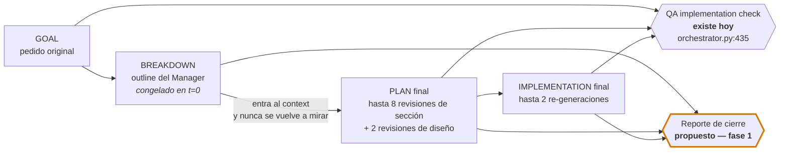
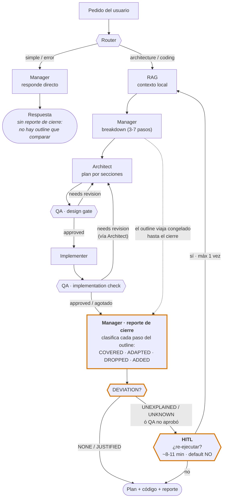
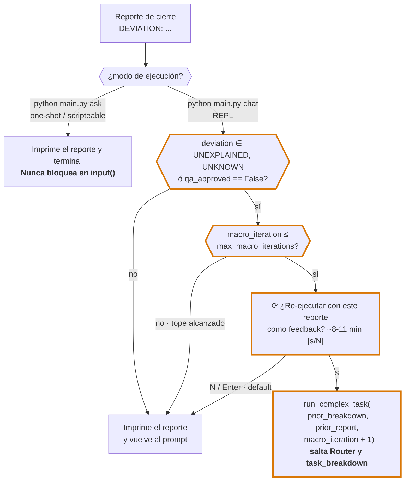

# Plan: reporte de cierre del Manager + macro-loop con HITL

## Contexto

El pipeline `Router → RAG → Manager → Architect↔QA → Implementer↔QA` funciona end-to-end y cierra con `Implementation check: APPROVED`. Lo que **no** existe es ningún artefacto que responda *"¿esto terminó haciendo lo que pedí?"* contra algo escrito **antes** de que empezaran las revisiones.

El hueco concreto, en código:

- El Manager se llama **una sola vez**, en `core/orchestrator.py:306-310` (`stage="task_breakdown"`). Su outline se pega como texto fijo dentro de `context` en `:312` y **nunca se vuelve a tocar**.
- Entre ese momento y el `return` de `:468-476` pasan, con `max_qa_iterations: 2`: hasta 3 pasadas de QA × 4 secciones en el design gate sectorizado (`:343-381`), más hasta 2 revisiones de plan + 2 re-implementaciones en el loop post-implementación (`:432-466`). El `plan` y la `implementation` pueden moverse mucho.
- El QA final (`:435`) usa `get_qa_review_template(goal, plan, implementation)` — compara contra el **plan** (que es justamente lo que se fue moviendo) y contra el goal original. **Nunca contra el breakdown del Manager.**
- El dict de retorno (`:468-476`) no incluye siquiera el `breakdown`.

O sea: la "orquestación" real es control de flujo Python dentro de `Orchestrator`; el rol "Manager" es un generador de esbozo inicial usado como contexto pasivo. La deriva funcional entre ese esbozo y el resultado final hoy **no se mide ni se reporta**.

**Objetivo:** cerrar el ciclo con un reporte del Manager que clasifique la deriva, y — solo si esa deriva resulta accionable en la práctica — habilitar un macro-loop cuya ejecución la confirma un humano, nunca el sistema.

---

## Hallazgos que condicionan el diseño

| # | Hallazgo | Evidencia |
|---|---|---|
| 1 | **La llamada de cierre es el punto más barato del pipeline para agregar trabajo.** `manager` y `qa_auditor` comparten tag (`gemma4:26b-a4b-it-qat`), y la última llamada antes del `return` es **siempre** un `implementation_check`: los dos `break` del loop (`:445-447` aprobado, `:448-453` agotado) salen inmediatamente después de la llamada QA. El modelo del Manager ya está cargado en VRAM. | `config/settings.yaml` (roles manager/qa_auditor) + `core/orchestrator.py:432-466`. Ollama corre con `-np 1`: un cambio de tag fuerza unload+reload; el mismo tag, no. |
| 2 | **El `breakdown` ya está en scope en el punto de retorno.** Es una variable local viva desde `:306` hasta `:476`. No hace falta refactor de plumbing para tenerlo disponible. | `core/orchestrator.py:306-476`. |
| 3 | **El fast path no tiene breakdown.** `SIMPLE_TASK`/`ERROR_REACTION` retornan en `:289-297` sin pasar por el Manager como planificador (el Manager ahí *es* la respuesta). | `core/orchestrator.py:278-297`. |
| 4 | **El prompt de cierre sería el más grande de todo el pipeline.** Lleva goal + breakdown + plan + implementation. La implementación es código completo: puede ser mayor que cualquier otro prompt que se manda hoy. | `get_implementer_task_template` ya manda plan+context; el de cierre agrega la salida de esa llamada encima. |
| 5 | **El Router es no-determinista y puede reclasificar mal.** Ya está documentado en `:154-164`: una respuesta ambigua podía resolver a `SIMPLE_TASK` y saltarse todo el pipeline. En una re-ejecución de macro-loop eso tiraría todo el trabajo previo a la basura. | `core/orchestrator.py:145-181`. |
| 6 | **`main.py ask` es one-shot y scripteable; `chat` ya bloquea en `input()`.** Un prompt interactivo en `ask` rompería el uso no-interactivo; en `chat` es el patrón que ya existe. | `main.py:112-119` (`ask_once`) vs `main.py:121-160` (`interactive_shell`, `input()` en `:130`). |

---

## Decisión de diseño central: clasificar la deriva, no medirla

**El reporte NO puede ser un binario "alineado / desviado".**

El `breakdown` se genera antes de que nadie mire el problema en profundidad: son 3-7 bullets de alto nivel de un modelo mid-size (`get_manager_breakdown_template`, `prompts/specialized_prompts.py:70-75`). Cuando el Architect revisa una sección es, en el caso normal, **porque QA encontró un defecto real** — es decir, el desvío suele ser una **corrección**, no una deriva.

Un veredicto binario marcaría como problema justamente las mejoras del pipeline. Dos runs así y el reporte se vuelve ruido que el humano aprende a ignorar: peor que no tenerlo, porque cuesta 25s y da falsa sensación de control.

Por eso el reporte pide **clasificación por paso del outline**:

| Estado | Significado | ¿Accionable? |
|---|---|---|
| `COVERED` | El paso está en el resultado final tal como se planteó. | No |
| `ADAPTED` | Está, pero resuelto distinto, y el motivo se ve en el plan/código. | No |
| `DROPPED` | El paso desapareció y **no hay explicación visible**. | **Sí** |
| `ADDED` | Hay trabajo en el resultado que no estaba en el outline. | Informativo |

Y un veredicto agregado que es lo único sobre lo que se ramifica:

```
DEVIATION: NONE | JUSTIFIED | UNEXPLAINED
```

Solo `UNEXPLAINED` (o un reporte imparseable, `UNKNOWN`) justifica ofrecer otra vuelta. `NONE`/`JUSTIFIED` se imprimen y listo.

---

## Otras decisiones

- **El Manager reporta; no edita.** No reescribe el plan ni la implementación. Si lo dejáramos corregir, tendríamos un tercer autor sobre el mismo artefacto y ninguna forma de saber quién introdujo qué. Su output es un juicio, y el actor que decide qué hacer con él es el humano.
- **El macro-loop es opt-in y solo vive en `chat`.** En `ask` se imprime el reporte y se termina. Un `input()` bloqueante en el camino scripteable es un bug, no una feature.
- **La re-ejecución reusa el breakdown original, no genera uno nuevo.** Si el Manager reescribe su outline en la segunda vuelta, se pierde la línea base contra la que se estaba midiendo y el reporte de la vuelta 2 no es comparable con el de la vuelta 1.
- **La re-ejecución salta el Router.** Ya sabemos que es una tarea de pipeline completo; volver a clasificar solo agrega una llamada y el riesgo del hallazgo 5 (caer al fast path y perder todo).
- **Tope duro además del humano.** `max_macro_iterations: 1` en config. El humano puede decir que no; el sistema no puede decir que sí más de una vez.
- **Falla suave, no cerrada.** A diferencia de `_parse_verdict` (`:241-250`), que falla cerrado porque de él depende si el código sale a producción, acá un parseo fallido no debe bloquear nada: se imprime el reporte crudo y se marca `UNKNOWN`. El humano lo lee igual.

---

## Diagramas

### 1. El hueco que se cierra: qué compara cada auditoría

El QA final ya existe y es riguroso, pero mira el `plan` — que es exactamente el artefacto que se fue moviendo durante todas las revisiones. El `breakdown` entra al `context` una vez y nadie lo vuelve a leer.



La diferencia es una sola arista: **`BREAKDOWN → CR` es la que hoy no existe en ningún lado.**

### 2. El pipeline completo con la propuesta



La flecha de vuelta entra en **RAG**, no en el Router: la re-ejecución conserva el `breakdown` original y salta la clasificación (hallazgo 5). Todo lo naranja es nuevo; el resto es el pipeline de hoy sin cambios.

### 3. Cuándo aparece el prompt del HITL



Tres frenos independientes antes de gastar otra vuelta: el veredicto tiene que ser accionable, el contador tiene que tener margen, y el humano tiene que decir que sí escribiendo algo — el Enter vacío es *no*.

---

## FASE 1 — El reporte de cierre (construir ahora)

Valor propio, independiente del macro-loop: hoy no existe **ningún** artefacto del run que compare el resultado contra algo escrito antes de la deriva.

### Tarea 1.1 — `prompts/specialized_prompts.py`

Nuevo template:

```python
@staticmethod
def get_manager_closing_report_template(goal, breakdown, plan, implementation) -> str:
```

- Recibe el outline original y el resultado final; pide clasificar **cada bullet del outline** en `COVERED`/`ADAPTED`/`DROPPED`/`ADDED` con una línea de nota.
- Cierra con `DEVIATION:` + `SUMMARY:`.
- El texto del prompt debe decir explícitamente que **una corrección justificada no es un desvío** — es la instrucción que evita el falso positivo descrito arriba.
- `implementation` se pasa recortada a `max_implementation_chars` (ver tarea 1.3), con marca visible de truncado si se recortó.

### Tarea 1.2 — `core/orchestrator.py`

- `_parse_closing_report(text) -> Tuple[str, str]` → `(deviation, summary)`. Regex sobre `DEVIATION:\s*(NONE|JUSTIFIED|UNEXPLAINED)` y `SUMMARY:`. Sin match → `("UNKNOWN", text.strip())`.
- Después del loop de implementación (`:466`), antes del `return`: llamada `role="manager", stage="closing_report"`, con `on_chunk=on_chunk` (**sí streamea** — a diferencia de las etapas QA, este texto lo lee el usuario tal cual).
- Entrada al `trace` con `entry["deviation"] = deviation`.
- Ampliar el dict de retorno con `"breakdown"`, `"closing_report"` y `"deviation"`.
- El fast path (`:289-297`) devuelve los tres campos en `None` — no hay outline que comparar (hallazgo 3).
- Knob de apagado: `pipeline.closing_report: true|false`. Si está en `false`, se salta la llamada y los campos van en `None`. Sin esto no hay forma de medir el costo A/B contra la baseline.

### Tarea 1.3 — `config/settings.yaml`

```yaml
pipeline:
  max_qa_iterations: 2
  request_timeout_seconds: 300
  closing_report: true
  closing_report_max_implementation_chars: 8000   # hallazgo 4: es el prompt más grande del pipeline
```

### Tarea 1.4 — `main.py`

- Nueva entrada en el `labels` de `_make_stage_printer` (`:93-98`): `"closing_report": (Colors.CYAN, "REPORTE DE CIERRE (Manager)")`.
- `_print_result` (`:64-84`): tras los banners de QA, imprimir el veredicto de desvío con color según estado (`NONE` verde, `JUSTIFIED` cian, `UNEXPLAINED`/`UNKNOWN` amarillo). El cuerpo del reporte ya salió por streaming; acá solo va el banner, igual que con plan/implementación.

---

## Verificación de la fase 1

**Sin Ollama** (script inline, no pytest — decisión ya tomada para esta etapa del proyecto):

- `_parse_closing_report` sobre: un reporte bien formado, uno con `DEVIATION` en minúsculas, uno sin la línea `DEVIATION` → debe dar `UNKNOWN` sin excepción, y uno vacío.
- Recorte de `implementation`: un string de 20.000 chars entra al template recortado a 8.000 + marca de truncado.

**Con Ollama:**

1. Query de baseline (el mismo rate limiter usado en todas las mediciones previas) con `closing_report: false` → confirmar que el run cierra idéntico a hoy (regresión del knob de apagado).
2. Mismo query con `closing_report: true`. Medir el `duration_ms` de `closing_report` en el trace. **Criterio:** ≤ ~35s y sin unload/reload de modelo entre `implementation_check` y `closing_report` (hallazgo 1). Si aparece un reload, la premisa de costo se cayó y hay que revisar por qué.
3. Fast path (`SIMPLE_TASK`): no debe emitir la etapa; los tres campos nuevos en `None`.
4. **Criterio cualitativo, el que realmente decide:** correr **4 queries reales distintas** y *leer* los reportes. La pregunta no es si parsea — es si distingue una corrección justificada de un paso caído. Un reporte que dice `UNEXPLAINED` porque el Architect renombró un endpoint es un falso positivo y hay que endurecer el prompt antes de seguir.

---

## Gate de decisión: ¿se construye la fase 2?

Con los 4 runs de la verificación 4 en la mano:

| Resultado observado | Decisión |
|---|---|
| ≥1 run con un `DROPPED` real (un paso del outline que efectivamente no está en el resultado y nadie explicó) | **Construir la fase 2.** El macro-loop tiene algo concreto que arreglar. |
| Todos `NONE`/`JUSTIFIED` | **No construir la fase 2.** El pipeline no está perdiendo trabajo; la fase 1 se queda como telemetría de confianza y nos ahorramos el resto. |
| Falsos positivos frecuentes | Iterar el prompt de la fase 1 y volver a medir. No pasar a fase 2 con un detector ruidoso: un macro-loop disparado por ruido cuesta 8-11 min por vuelta. |

Esto es lo que hace que la fase 1 valga la pena aun si la fase 2 nunca se construye: **es la que genera la evidencia para decidir**.

---

## FASE 2 — Macro-loop con HITL (condicionada al gate)

### Tarea 2.1 — `core/orchestrator.py`: parámetros de re-entrada

```python
async def run_complex_task(
    self, user_query, on_chunk=None,
    prior_breakdown: Optional[str] = None,
    prior_report: Optional[str] = None,
    macro_iteration: int = 1,
) -> Dict[str, Any]:
```

- `prior_breakdown` presente → **saltar** la llamada `task_breakdown` (`:306-310`) y usar el outline recibido. Ahorra ~23s y, sobre todo, mantiene estable la línea base.
- `prior_report` presente → se agrega a `context` como bloque `PREVIOUS ATTEMPT — MANAGER FINDINGS`, para que el Architect arranque desde los huecos ya detectados en vez de redescubrirlos.
- `prior_breakdown` presente → **saltar el Router** y forzar el camino de pipeline completo (hallazgo 5).
- `macro_iteration` viaja al `trace` y al `request_id` logueado, para poder separar las vueltas al leer el log.

### Tarea 2.2 — `config/settings.yaml`

```yaml
pipeline:
  max_macro_iterations: 1   # vueltas EXTRA como máximo; el humano igual tiene que confirmar cada una
```

### Tarea 2.3 — `main.py`: el HITL, solo en `chat`

En `interactive_shell` (`:150-154`), tras imprimir el resultado:

- Ofrecer la re-ejecución **solo si** `deviation in ("UNEXPLAINED", "UNKNOWN")` **o** `qa_approved is False`, y `macro_iteration <= max_macro_iterations`.
- Prompt explícito con el costo a la vista, porque la decisión es sobre gastar 8-11 minutos:
  ```
  ⟳ El Manager detectó desvío sin explicar. ¿Re-ejecutar con este reporte como feedback?
    (otra vuelta completa del pipeline, ~8-11 min) [s/N]:
  ```
- Default `N`. Enter vacío = no.
- Si sí: `run_complex_task(user_query, on_chunk=..., prior_breakdown=result["breakdown"], prior_report=result["closing_report"], macro_iteration=2)`.
- En `ask_once` (`:112-119`): **no** preguntar. Imprimir el reporte y una línea indicando que la re-ejecución está disponible en `chat`.

### Verificación de la fase 2

1. Query que en la fase 1 dio `UNEXPLAINED` → en `chat` debe aparecer el prompt; responder `n` cierra igual que hoy.
2. Responder `s` → confirmar en el log: **no hay** etapa `routing`, **no hay** etapa `task_breakdown`, y el `context` de la vuelta 2 contiene el bloque de findings.
3. Comparar el reporte de cierre de la vuelta 2 contra el de la vuelta 1: los `DROPPED` de la vuelta 1 deberían moverse a `COVERED`/`ADAPTED`. **Si no se mueven, el macro-loop no sirve para esa clase de defecto** y hay que documentarlo antes que insistir.
4. Tope: con `max_macro_iterations: 1`, la vuelta 2 no vuelve a ofrecer una vuelta 3, aunque siga en `UNEXPLAINED`.
5. Regresión: `ask` sigue sin bloquear (probarlo redirigiendo stdin desde `/dev/null`).

---

## Riesgos

| # | Riesgo | Mitigación |
|---|---|---|
| 1 | **El Manager y el QA Auditor son el mismo modelo** (`gemma4:26b-a4b-it-qat`): puntos ciegos correlacionados, y el reporte podría sellar de goma lo que QA ya aprobó. | El prompt es distinto y, sobre todo, el **artefacto de referencia** es distinto (el breakdown, que el QA nunca vio). Si aun así resulta complaciente, el fallback es usar el modelo del Architect para el cierre — al costo de un unload/reload, que es exactamente lo que hoy sale gratis. Se decide con los 4 runs de la verificación. |
| 2 | **Falso positivo sistemático**: reporta desvío cuando el pipeline mejoró el diseño. Es el modo de fallo que vuelve inútil todo lo demás. | Es el motivo de la clasificación de 4 estados en vez de un binario, y el criterio explícito del gate de decisión. Un detector ruidoso **no** pasa a fase 2. |
| 3 | **El prompt de cierre es el más grande del pipeline** (hallazgo 4): puede disparar latencia o degradar la calidad por dilución. | `closing_report_max_implementation_chars: 8000` desde el primer run, con marca de truncado. La verificación 2 mide el `duration_ms` real contra el techo de ~35s. |
| 4 | **Macro-loop infinito o caro**: cada vuelta son 8-11 min. | Tres frenos independientes: `max_macro_iterations: 1`, confirmación humana por vuelta, y el prompt muestra el costo estimado antes de preguntar. |
| 5 | **Re-clasificación del Router en la vuelta 2** manda todo al fast path y descarta el trabajo. | Saltar el Router cuando hay `prior_breakdown` (tarea 2.1). |
| 6 | **+25s en todos los runs** para un reporte que nadie lee. | Streamea (se lee mientras se genera, no es espera muerta) y tiene knob de apagado (`closing_report: false`). El gate de decisión existe justamente para no pagarlo si no aporta. |

---

## Fuera de alcance (anotado)

- **Que el sistema decida solo re-ejecutar.** El humano confirma. Es requisito, no limitación.
- **Que el Manager reescriba plan o implementación.** Reporta, no edita.
- **Reconciliar automáticamente el breakdown con el plan final** (regenerar el outline para que "coincida"). Eso destruye la línea base y convierte el reporte en tautología.
- **Etapa (d)** (reporte de secciones truncadas/revisadas en `main.py`) sigue despriorizada, sin cambios.
- **HITL en `ask`.** El camino scripteable no bloquea, por diseño.
