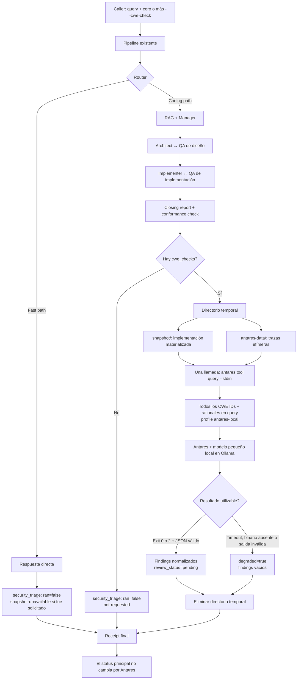

# Plan: capa de security advisor (Antares) — integración inicial

## Contexto

`docs/antares-advisor-portability-guide.md` es un artefacto de conocimiento (no un
plan) que documenta cómo portar el advisor de localización de vulnerabilidades
Antares desde `dubbridge` a este pipeline. Trae un kernel de invariantes de
referencia (I1–I11) y una tabla de transferencia COPY/ADAPT/CREATE/SKIP, y deja
diez preguntas abiertas en §10 para que "el agente que adapta" las resuelva contra
el código real.

`docs/antares-refinamiento-fase1-resumen.md` ya avanzó la pregunta 1 (¿quién
provee el CWE?) con una dirección candidata razonada — pero identifica
explícitamente la **pregunta 4** (¿de dónde sale el snapshot navegable?) como el
verdadero bloqueante: nada del mecanismo tiene sentido hasta que Antares tenga un
árbol de directorio real contra el cual correr `grep`/`find`/`cat`.

Verifiqué contra el código actual (`core/orchestrator.py`, `main.py`,
`core/ingestor.py`) que ese bloqueo es real hoy: `implementation` es un string en
memoria al final de `_run_pipeline_body` (línea ~885, justo antes del closing
report en línea 887), nunca se escribe a disco; `Orchestrator` no guarda
referencia a ningún directorio ingerido (`ingest` es un comando CLI aparte que
nunca persiste `directory` en `self`); y no existe precedente de `subprocess`
productivo en el pipeline (solo en `tests/run_schema_ab.py`, un harness de test).

Este plan cierra las preguntas 1, 3, 4, 5, 6, 7 y 8 de §10 con decisiones
concretas ancladas en el código real, y especifica un primer corte
**implementable** de la capa: un touchpoint post-implementación que no gatea,
que materializa un árbol temporal, invoca una sola vez el `antares` CLI oficial vía
subprocess para todos los CWEs solicitados, y normaliza el resultado en
`outcome.security_triage` del receipt existente. Las
preguntas 2, 9 y 10 quedan explícitamente diferidas (con la razón documentada) por
no ser bloqueantes para un primer corte funcional.

Es deliberadamente una **prueba de concepto local**, no un diseño de producción:
el objetivo es descargar una tarea estrecha en un modelo pequeño especializado y
observar su utilidad, manteniendo intacta la responsabilidad de los modelos
generalistas y del caller.

## Workflow propuesto



La bifurcación importante es `cwe_checks`: sin opt-in no hay carga ni swap del
modelo especializado. Con opt-in hay una sola invocación para todos los CWEs y,
termine bien o mal, el pipeline principal conserva su resultado.

## Decisiones de diseño (resuelven §10)

**P1 — fuente del CWE: caller-supplied, no watchlist (ya resuelto en fase 1).**
Se adopta la dirección candidata del resumen de fase 1: `--cwe-check
CWE-ID:rationale` (uno o más), acumulados en la request igual que
`output_contract`. El rationale es obligatorio — sin él, degrada al sweep no
justificado que I2 prohíbe. No hay watchlist en este primer corte (la tabla de
transferencia la deja como fuente L1 coexistente, no reemplazada; construirla es
trabajo futuro, no bloqueante).

**P4 — origen del snapshot: materializar un árbol temporal efímero.** De las tres
opciones que deja abiertas el resumen de fase 1 (materializar temp tree / escanear
baseline pre-cambio / saltear el seam), se elige **materializar**, porque es la
única que evalúa el código que realmente importa (la implementación nueva, no la
preexistente) y porque el pipeline ya tiene el string completo en memoria
(`implementation`, `core/orchestrator.py:885`) sin ningún trabajo adicional de
adquisición. Mecanismo: `tempfile.TemporaryDirectory()` con dos subdirectorios,
`snapshot/` y `antares-data/`; escribir `implementation` bajo `snapshot/` (nombre
inferido del `output_contract` si aplica, o `implementation.txt` si no hay pista de
lenguaje), invocar el CLI con `snapshot/` como `target` y
`ANTARES_DATA_DIR=antares-data/`, y destruir todo al salir del `with`. Al parsear
`fenix-tagged-file`, validar que cada `PATH` sea relativo, no contenga `..` y siga
dentro de `snapshot/` después de resolverlo; `ACTION: delete` no materializa archivo.
Así ni la salida del modelo ni las trazas propias del CLI tocan el proyecto real.

**P3 — touchpoint: un único seam, post-implementación.** Se ejecuta en
`run_complex_task` después de que `_run_pipeline_body` devuelve el body completo
y antes de construir el receipt. Así analiza la implementación final, no altera
el orden actual de llamadas a los modelos generalistas y queda fuera del
`asyncio.wait_for` que limita la pipeline principal. Se descarta el seam
pre-implementación (todavía
no hay código que escanear) y el seam post-CI (este repo no tiene CI propio sobre
el que engancharse — es un motor invocado por un caller externo). Un solo
touchpoint para el primer corte; §10.3 documentaba tres en el repo fuente pero ese
repo tenía tres seams reales (gate de diseño, check de código, CI). Acá solo uno
tiene un snapshot disponible sin trabajo adicional.

**P5 — ejecución delegada al CLI oficial de Antares, no ejecución propia.** Sigue
la recomendación explícita de §5.2 de la guía: se invoca `antares tool query
--stdin` como subprocess, nunca se reimplementa el parser de wire-protocol ni el
sandbox (§9.1 de la guía documenta por caso real por qué eso salió mal en la
fuente). Este repo delega L3+L4 enteros al CLI. Se hace **una sola invocación por
request**, pasando todos los `cwe_ids` juntos. Los rationales se combinan en un texto
estable y se envían en el campo `query` del request JSON, para que sean instrucciones
reales del análisis y no solo metadata del receipt. Lo único que se construye acá es
el lado *caller* de un subprocess — mismo patrón que `tests/run_schema_ab.py` ya
usa contra el propio `main.py` (`subprocess.run(..., timeout=..., capture_output=True,
text=True)`), pero en producción, dentro de `core/orchestrator.py`.

**P6 — el resultado vive dentro del receipt existente, no al lado.** Sigue el
patrón que la guía misma recomienda en §7.2 ("reusá el instinto"): el helper
agrega `outcome.security_triage` al body devuelto por `_run_pipeline_body`, junto
a `rag`, `schema_grounding`, `design_gate`, etc., antes de llamar a
`build_receipt`. Usa el mismo contrato `ran: true|false` que esos campos. Se sube
`SCHEMA_VERSION` a **1.2** para hacer visible el cambio de contrato; sigue siendo
aditivo, por lo que un consumidor que solo lee las keys conocidas continúa
funcionando.

**P7 — trazas: efímeras y fuera del repo (I9).** El CLI guarda por defecto trazas y
run history bajo su propio data dir, por lo que no alcanza con descartar
`stdout`/`stderr`. El subprocess recibe un environment heredado con
`ANTARES_DATA_DIR` sobrescrito al subdirectorio temporal `antares-data/`. El receipt
solo conserva `sha256` del stdout y los campos normalizados; el árbol completo,
incluidas las trazas creadas internamente por Antares, desaparece al salir del
context manager. Persistencia, redacción y retención configurable quedan para una
fase posterior.

**P8 — presupuesto de residencia: solo on-demand, nunca por request implícita.**
Antares es un sexto modelo de clase distinta (§5.2 de la guía lo señala
explícitamente: no es un rol del pipeline, no es intercambiable con uno). Dado
que Ollama es single-slot y ya swappea 5 roles, el touchpoint **solo corre si el
caller pidió explícitamente `--cwe-check` en esa request** — nunca automático,
nunca "siempre que hay implementación". Esto también resuelve la pregunta de costo:
cero costo de swap en el camino común, costo de swap solo cuando el caller decidió
que vale la pena. En esta PoC la invocación es síncrona y puede agregar hasta
`timeout_seconds` de latencia cuando fue solicitada. Es una relajación consciente de
la lectura literal de I1: Antares nunca cambia el status principal, aprueba ni gatea,
pero el caller opt-in sí espera el resultado. El timeout propio de Antares queda
fuera del `pipeline.max_run_seconds`, por lo que no puede convertir en `timeout`
una pipeline principal ya completada. Moverlo a background queda fuera de este
corte.

## Preguntas diferidas (explícitamente, con razón)

- **P2 (disposición cuando el revisor puede ser un modelo):** este primer corte no
  incluye ledger. Todo finding nace con `review_status: "pending"`; el resultado
  llega al caller y nunca se presenta como cerrado o confirmado. Persistir una
  disposición humana queda para una fase posterior.
- **P9 (lenguajes que debe soportar la clausura L2):** no aplica — este primer
  corte no implementa clausura de dependencias (L2) en absoluto. El "packet" es
  el único archivo con la implementación nueva, sin cierre de imports. Es una
  limitación real (Antares pierde contexto de archivos relacionados) documentada
  abajo, no un vacío accidental.
- **P10 (¿puede el índice de retrieval informar la selección de seeds?):**
  diferido — es una optimización sobre P9/L2, que ya está fuera de este corte.

## Cambios concretos

### 1. `context/antares/` (paquete nuevo, mirror de `context/schema/`)

- **`context/antares/base.py`** — dataclasses del resultado normalizado:
  `AntaresFinding` (`title: str`, `file_path: str`, `cwe_ids: List[str]`,
  `likelihood_of_exploit: str`, `submission_rank: Optional[int]`,
  `review_status: str = "pending"`), `AntaresResult` (`findings`,
  `terminal_state`, `degraded`, `stdout_sha256`) y una excepción
  `AntaresInvocationError` (nunca se propaga fuera del orchestrator).
- **`context/antares/invoke.py`** — `async def run_antares_query(target_dir: str,
  data_dir: str, cwe_checks: List[Tuple[str, str]], *, binary: str,
  profile: Optional[str], timeout_seconds: int) -> AntaresResult`. Implementa P5:
  resuelve el binario en PATH primero; arma una única request
  `{"target": target_dir, "cwe_ids": [...], "query": <rationales>}` y agrega
  `"profile"` solo si está configurado; usa `asyncio.create_subprocess_exec` (no
  `create_subprocess_shell`), pasa un environment heredado con
  `ANTARES_DATA_DIR=data_dir`, escribe el JSON a stdin y lee stdout/stderr con
  timeout, `cwd=target_dir` y un límite de 1 MiB para la salida capturada. En
  timeout mata el proceso y drena los pipes. Trata los
  exit codes `0` y `2` como reporte válido (parsea el body en ambos, por el
  contrato exacto documentado en §5.2 de la guía — tratar `2` como fatal descarta
  resultados buenos). Cualquier otro código, JSON inválido, salida mayor al
  límite o timeout →
  `AntaresInvocationError` con un `terminal_state` explícito (`binary-unavailable`,
  `execution-failed`, `output-malformed`, `output-too-large`, `timeout`) — nunca una excepción
  genérica, siguiendo el §7.1 de la guía (taxonomía de estados terminales, ningún
  bucket "error" genérico). Un JSON válido con `findings: []` es un resultado
  `completed`, no una degradación. Cada `file_path` retornado se normaliza a una
  ruta relativa al snapshot; una ruta que escape de él vuelve la salida
  `output-malformed` y nunca se expone como path temporal absoluto en el receipt.
- **`context/antares/materialize.py`** — `materialize_implementation(implementation:
  str, output_contract: Optional[str]) -> ContextManager[MaterializedImplementation]`,
  un `contextlib.contextmanager` sobre `tempfile.TemporaryDirectory()` que crea
  `snapshot/` y `antares-data/` y devuelve ambos paths.
  Nombre de archivo: si `output_contract == "fenix-tagged-file"`, ya hay una
  gramática con `PATH` explícito por archivo (ver `prompts/specialized_prompts.py`)
  — parsearla y materializar *cada* archivo `create|modify`, validando contención
  antes de escribir; `delete` se omite. Si no hay contrato, usar el nombre genérico
  documentado abajo.

  **Ambigüedad de archivo único (issue real, resuelto así):** sin
  `output_contract`, el pipeline no sabe qué lenguaje es `implementation` — es
  prosa+código mezclados en muchos casos. Se escribe tal cual a
  `implementation.txt` dentro del árbol temporal. Ese camino prueba conectividad
  y tolerancia a fallos, pero ofrece menos señal que un output estructurado. El
  smoke funcional de seguridad usará `fenix-tagged-file`; la PoC no intenta
  inferir lenguaje ni reconstruir un repositorio completo (P9, diferida).

### 2. `core/orchestrator.py`

- Nuevo parámetro en `run_complex_task`: `cwe_checks:
  Optional[List[Tuple[str, str]]] = None` (lista de `(cwe_id, rationale)`),
  agregado a la firma junto a `output_contract`/`schema_snapshot` (mismo
  patrón — threading explícito, no un dict genérico de kwargs). No hace falta
  pasarlo a `_run_pipeline_body`: al volver de ese método, `run_complex_task` ya
  tiene `body["artifacts"]["implementation"]` y `body["outcome"]["fast_path"]`.
- El enriquecimiento se ejecuta después del `await _run_pipeline_body(...)` y
  fuera de su `asyncio.wait_for`, pero antes de `build_receipt`. En el caso común
  sin `--cwe-check` no cambia el orden de llamadas existentes ni el trace.
- Lógica: si `cwe_checks` está vacío → `security_triage = {"ran": False,
  "terminal_state": "not-requested", "degraded": False, "requested": [],
  "stdout_sha256": None, "findings": []}` y retorno inmediato del helper. Si no está vacío,
  materializar una vez y
  llamar **una sola vez** a `run_antares_query` con la lista completa. Esto evita
  N invocaciones y N cargas del modelo para una misma request. **Todo el bloque
  envuelto en un
  `try/except Exception` local que nunca deja escapar la excepción** — captura
  explícitamente `AntaresInvocationError` para el caso esperado y un `except
  Exception` genérico como red de seguridad, porque I1 dice que la ausencia o
  falla de Antares nunca puede tumbar la pipeline entera (a diferencia de
  `ModelCallError`, que si se propaga aborta todo el receipt vía el catch de
  `run_complex_task` — ver línea 570-589). Cualquier falla se normaliza a
  `{"ran": True, "degraded": True, "terminal_state": ..., "findings": []}`.
  Si la pipeline principal falla o expira antes de devolver `body`, Antares no se
  invoca y se conserva el contrato de error existente.
- En el fast path no existe implementación de código que escanear: incluir
  `security_triage = {"ran": False, "terminal_state": "snapshot-unavailable",
  "degraded": True, "reason": "fast-path", "requested": [...],
  "stdout_sha256": None, "findings": []}`
  si el caller había pedido `--cwe-check`, en vez de omitir silenciosamente el
  bloque.
- El resultado se agrega al dict de retorno en `outcome.security_triage` (junto
  a los demás bloques de outcome, línea ~949-965):
  ```python
  "security_triage": {
      "ran": bool(cwe_checks),
      "requested": [{"cwe_id": c, "rationale": r} for c, r in (cwe_checks or [])],
      "terminal_state": "completed",  # o estado degradado tipado
      "degraded": False,
      "stdout_sha256": "...",
      "findings": [...],  # cada uno con file_path, cwe_ids, review_status="pending"
  }
  ```

  Semántica cerrada de estados:

  | Caso | `ran` | `terminal_state` | `degraded` |
  |---|---:|---|---:|
  | No se solicitó | `false` | `not-requested` | `false` |
  | Fast path sin snapshot | `false` | `snapshot-unavailable` | `true` |
  | Reporte válido, incluso sin findings | `true` | `completed` | `false` |
  | Se intentó y falló Antares | `true` | estado tipado de fallo | `true` |

### 3. `main.py`

- `_parse_ask_args`: nuevo flag repetible `--cwe-check CWE-ID:rationale`
  (acumula en una lista, igual convención que las demás flags — ver
  `_parse_ask_args`, línea 302-376). Parseo: split en el primer `:`, rechazar si
  falta el rationale (`"--cwe-check requiere 'CWE-ID:rationale' — el rationale es
  obligatorio."` → `EXIT_USAGE`, cumpliendo el "no negociable" de la fase 1: sin
  rationale no hay CWE check). Validar formato básico de `CWE-ID` (regex
  `^CWE-\d+$`) como usage error, no como degradación silenciosa en runtime.
- Banner de uso (línea ~379-394): agregar la línea de ayuda para `--cwe-check`.
- `DevOrchestratorCLI.ask_once(...)` recibe `cwe_checks` y lo reenvía a
  `run_complex_task(...)`; el branch `main.py ask` pasa
  `opts["cwe_checks"]`. El REPL queda sin cambios: esta PoC expone el opt-in solo
  en el camino scriptable `ask`.

### 4. `config/settings.yaml`

- Nueva sección `security_triage:` (paralela a `schema_grounding:`):
  ```yaml
  security_triage:
    binary: "antares"          # resuelto por PATH
    profile: "antares-local"   # profile del CLI que apunta al modelo pequeño local
    timeout_seconds: 300       # ancla de la guía §5.2 ("300s, funcionó")
  ```
  Sin sección `roles.antares`: el modelo pequeño local se configura y sirve mediante
  el profile del CLI, no mediante `ModelFactory`. Si `profile` es `null`, el CLI usa
  su configuración/environment habitual. Para el smoke real, `antares-local` debe
  existir en `~/.antares/profiles.toml` y Ollama debe servir su endpoint; si no,
  el stage degrada en el receipt sin impedir la ejecución principal.

### 5. `core/receipt.py`

- `SCHEMA_VERSION`: `"1.1"` → `"1.2"`, comentario aditivo siguiendo el patrón
  existente (línea 5-10).
- `build_config_fingerprint`: agregar un bloque de configuración
  `security_triage` con `binary`, `profile` y `timeout_seconds`. En
  `request_params`, agregar `cwe_checks_requested: [cwe_id, ...]` (sin el
  rationale completo en el fingerprint, que ya vive en
  `outcome.security_triage.requested`).

## Lo que este corte NO hace (alcance explícito)

- No implementa L2 (clausura de dependencias) — el snapshot contiene solo los
  archivos materializados desde la implementación, no un packet con cierre de
  imports (P9/P10 diferidas).
- No implementa L6 (disposition ledger) — el resultado normalizado es toda la
  responsabilidad de este repo; todos los findings quedan en `pending` y la
  disposición queda del lado del caller (P2 diferida).
- No incorpora Antares como un sexto rol generalista de `ModelFactory`; el CLI y su
  profile son dueños del backend local.
- No agrega una watchlist curada (L1 alternativa) — solo el camino
  caller-supplied de P1.

## Verificación

1. **Test offline sin Ollama ni Antares real**: un test unitario para
   `context/antares/invoke.py` con un ejecutable Python fake simulando el
   contrato: exit 0/2 con JSON válido, exit 1, JSON malformado, salida mayor a
   1 MiB y timeout. Verificar que una request con varios CWEs produce **una sola
   invocación**, que `query` contiene los rationales, que `cwd` apunta al snapshot,
   que `ANTARES_DATA_DIR` apunta al temp y que cada caso mapea al
   `terminal_state` correcto. Sigue el patrón de
   `tests/run_conformance_gate.py` (offline, sin red, sin Ollama).
2. **Test de materialización**: verificar que `materialize_implementation`
   escribe los archivos `create|modify`, omite `delete`, rechaza rutas absolutas
   o con traversal y que `snapshot/` y `antares-data/` desaparecen al salir del
   context manager.
3. **Smoke test end-to-end condicional**: si `antares` está instalado y
   el profile/backend local está disponible (skip si no), correr `python main.py
   ask --json --output-contract fenix-tagged-file --cwe-check
   "CWE-89:la nueva función construye SQL desde input del usuario" "<query de
   implementación>"` y verificar que `outcome.security_triage.ran == true`, el
   receipt sigue siendo JSON válido con `schema_version: "1.2"` y no quedan
   directorios temporales.
4. **Verificar I1 en el peor caso**: simular `antares` binario ausente
   (`PATH` sin él) y confirmar que el receipt completo llega igual con
   `status: "completed"` y `outcome.security_triage.degraded: true`
   — nunca `status: "failed"` por causa de Antares.
5. **Revisar manualmente** que ningún string de shell se construye en
   `invoke.py` (grep por `shell=True`, `os.system`, f-strings pasadas a
   `create_subprocess_shell`) — cumple I5 por construcción, pero vale
   verificarlo explícitamente dado que es un invariante de seguridad.
6. **Contrato del receipt**: cubrir no solicitado, fast path, éxito con cero
   findings, éxito con findings y fallo degradado; comprobar que todo finding
   conserva `title`, CWE y path relativo, siempre con `review_status: "pending"`.

## Criterio de cierre de la PoC

La integración se considera cerrada cuando los tests offline pasan, el pipeline
mantiene `status: "completed"` ante cualquier fallo de Antares, una request con
varios CWEs dispara una sola invocación, no queda ningún archivo temporal y el
smoke condicional demuestra al menos que el modelo pequeño puede devolver un
reporte válido sobre una implementación estructurada. La calidad de detección se
observará, pero no se convierte en gate ni en promesa de cobertura en esta fase.

## Tareas y orden de ejecución

El orden está determinado por dependencias de import reales entre módulos, no
por prioridad arbitraria: cada tarea arranca solo cuando lo que necesita
importar ya existe. `context/antares/` sigue el mismo orden interno que
`context/schema/` (base → materialización/selección → integración).

**T0. Incorporar este plan al proyecto.** Crear
`docs/plan-security-advisor-antares.md` con el contenido de este plan,
mismo formato que `docs/plan-schema-grounding.md` /
`docs/plan-schema-conformance.md` / `docs/plan-receipt-interface-callers.md`.
Sin dependencias — se hace primero para que el resto del trabajo tenga un
ancla citable en el propio repo, igual que el resto de los planes
referenciados desde `CLAUDE.md`.

**T1. `config/settings.yaml`.** Agregar el bloque `security_triage:` (ver
"Cambios concretos #4"). Sin dependencias de código nuevo; se hace temprano
porque T6 lee estas keys.

**T2. `context/antares/base.py`.** `AntaresFinding`, `AntaresResult`,
`AntaresInvocationError`. Sin dependencias — es el módulo hoja del paquete
nuevo, mismo rol que cumple `context/schema/base.py` en el paquete existente.

**T3. `context/antares/materialize.py`.** Depende de T2 solo por convención de
paquete (no importa nada de `base.py`). Define `MaterializedImplementation`
(contenedor `snapshot_dir`/`data_dir`) directamente en este módulo — no hace
falta promoverlo a `base.py` porque solo lo consumen `invoke.py` y
`orchestrator.py`.

**T4. `context/antares/invoke.py`.** Depende de T2 (`AntaresResult`,
`AntaresInvocationError`). No depende de T3 en tiempo de import (recibe
`target_dir`/`data_dir` como strings), pero sí en uso real — el orchestrator
llama primero a T3 y pasa su resultado a T4.

**T5. `core/receipt.py`.** Bump `SCHEMA_VERSION` 1.1 → 1.2 y bloque
`security_triage` en `build_config_fingerprint` (ver "Cambios concretos #5").
Depende de T1 (lee las mismas keys de config que T1 agrega), no de
`context/antares/*`.

**T6. `core/orchestrator.py`.** El touchpoint en `run_complex_task` (P3):
parámetro `cwe_checks`, manejo de fast-path, `outcome.security_triage`. Depende
de T1–T5 completas: importa los tres módulos de `context/antares/`, lee
`config["security_triage"]` y llama a `build_receipt`/`build_config_fingerprint`
de T5.

**T7. `main.py`.** Flag `--cwe-check`, parseo/validación en `_parse_ask_args`,
wiring en `ask_once` y el banner de uso. Depende de T6 — la firma de
`run_complex_task` debe aceptar `cwe_checks` antes de poder reenviarlo.

**T8. Tests offline.** Unit tests de `invoke.py` (ejecutable fake: exit 0/2/1,
JSON inválido, salida > 1 MiB, timeout; verificar una sola invocación,
`query`/`cwd`/`ANTARES_DATA_DIR`) y de `materialize.py` (create/modify/delete,
rutas absolutas o con traversal rechazadas, cleanup del tempdir al salir del
context manager). Depende de T2–T4 (son los módulos bajo test), no de T6/T7.

**T9. Smoke test condicional end-to-end.** Depende de T1–T7 completas —
necesita el CLI real de `antares` más `main.py ask --cwe-check` ya wireado.
Skip automático si `antares` no está en PATH o el profile no responde.

**T10. Checklist de verificación manual.** Grep de `shell=True`/`os.system` en
`context/antares/invoke.py` (I5); recorrido de la matriz de estados del
receipt (no solicitado / fast-path / éxito sin findings / éxito con findings /
degradado); confirmar `status: "completed"` con el binario ausente. Depende de
T6 completo; se corre al final, antes de dar la PoC por cerrada.

**T11. `CLAUDE.md`.** Actualizar la sección "Known gaps" documentando la capa
construida, mismo patrón que las entradas existentes de schema-grounding /
receipt / output-contracts, apuntando a `docs/plan-security-advisor-antares.md`
(T0). Depende de T1–T10 verificadas, para no documentar algo que todavía puede
cambiar de forma.

**T12. `README.md`.** Depende de T11 (mismo contenido, nivel usuario en vez de
interno). Dos cambios puntuales, siguiendo el patrón ya usado ahí para
`--schema-file`/`--output-contract`:
- Agregar un ejemplo de `--cwe-check` a la sección "5. Driving it from another
  program" (línea ~127-134), junto al resto de flags opcionales de `ask`.
- Extender el párrafo del receipt (línea 137) para mencionar
  `outcome.security_triage` junto a `outcome.schema_grounding`, con la misma
  salvedad ya presente ahí de "self-reported, verificalo vos" — sin prometer
  que el finding es correcto, solo que el campo existe y qué significa cada
  `terminal_state`.
Última tarea de la lista — cierre de documentación externa una vez que el
comportamiento interno (T1–T11) ya está verificado y estable.
